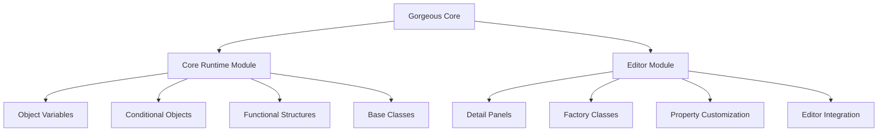
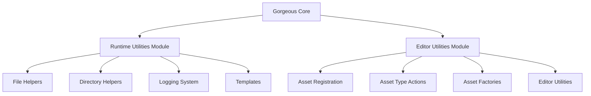
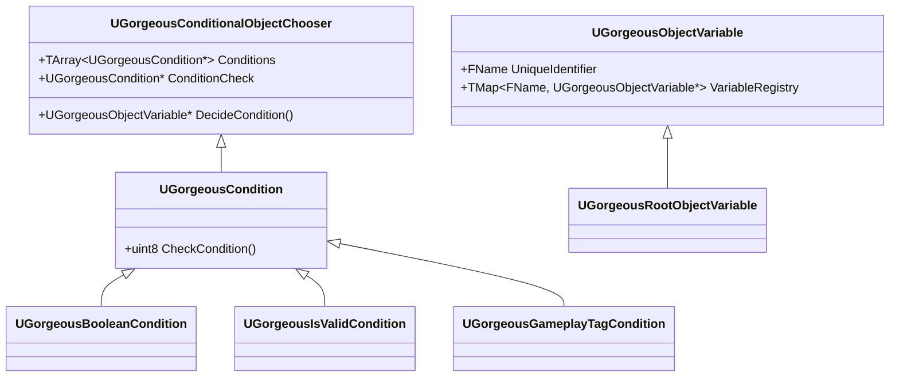
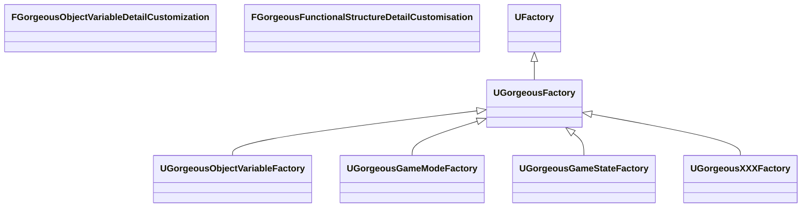
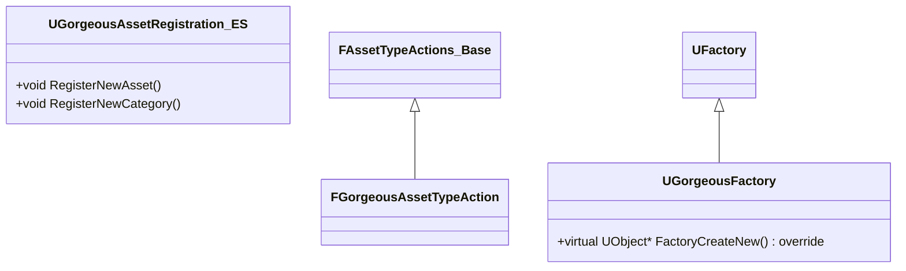
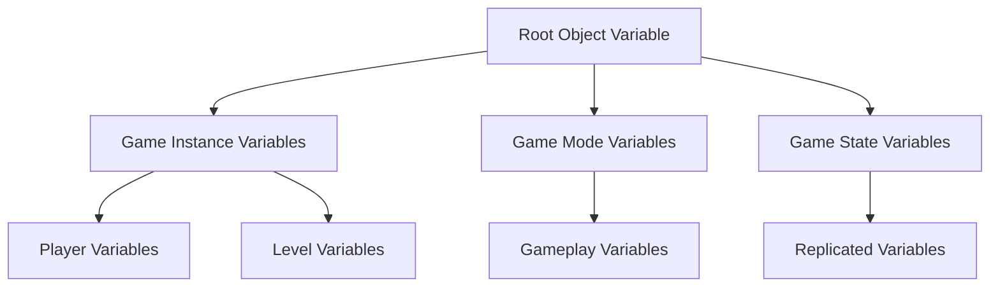
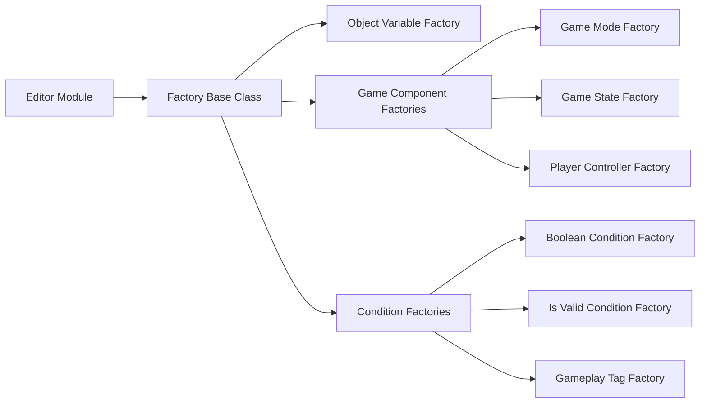
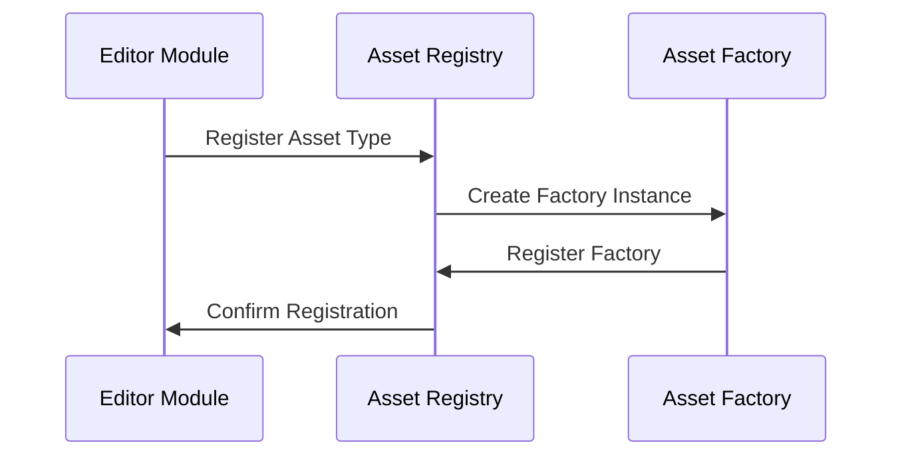
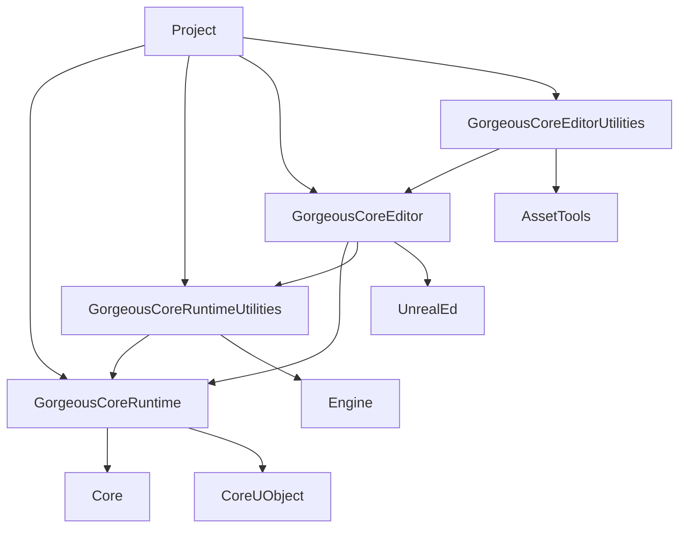

# 🛠️ Technical 🛠️

???+ info "Short Description"

    Gorgeous Core is built on a modular architecture with four main components: Core Runtime, Runtime Utilities, Editor, and Editor Utilities. This technical documentation provides an overview of the architecture, class hierarchy, and key systems.

??? info "Long Description"

    The technical architecture of Gorgeous Core is designed to be modular, extensible, and efficient. It consists of four main modules that work together to provide a comprehensive set of tools and utilities for Unreal Engine development. This document explains the architecture, class hierarchy, and key systems in detail.

## 🏗️ Architecture

The Gorgeous Core plugin is structured into four main modules, split between core and utility modules:

### Core Modules


### Utility Modules


## 🔄 Module Structure

### Core Runtime Module


### Editor Module


### Editor Utilities Module


## 📝 Implementation Details

### Object Variable System
The object variable system uses a hierarchical structure:


### Factory System
The factory system for creating Gorgeous objects:


### Asset Registration
The asset registration system:


## 🔧 Build System

The module dependencies are managed through Build.cs files:



## 🔍 Key Classes and Interfaces

### Core Runtime
- `UGorgeousObjectVariable`: Base class for all object variables
- `UGorgeousConditionalObjectChooser`: Handles dynamic object selection
- `UGorgeousCondition`: Base class for all conditions

### Editor
- `FGorgeousObjectVariableDetailCustomization`: Customizes object variable properties
- `FGorgeousFunctionalStructureDetailCustomisation`: Handles structure property changes
- `UGorgeousFactory`: Base class for all Gorgeous object factories

### Editor Utilities
- `FGorgeousAssetTypeAction`: Defines how assets behave in the editor
- `FGorgeousAssetRegistration`: Handles asset registration and unregistration
- `UGorgeousFactory`: Creates new Gorgeous assets

## 🔄 Extension Points

1. **Custom Object Variables**
```cpp
UCLASS()
class MYGAME_API UMyCustomVariable : public UGorgeousObjectVariable
{
    GENERATED_BODY()
    // Implementation
};
```

2. **Custom Conditions**
```cpp
UCLASS()
class MYGAME_API UMyCustomCondition : public UGorgeousCondition
{
    GENERATED_BODY()
    // Implementation
};
```

3. **Custom Asset Types**
```cpp
class FMyCustomAssetTypeAction : public FGorgeousAssetTypeAction
{
    // Implementation
};
```

## 🔧 Configuration Options

1. **Build Configuration**

```c#
public class MyGameModule : ModuleRules
{
    public MyGameModule(ReadOnlyTargetRules Target) : base(Target)
    {
        PublicDependencyModuleNames.AddRange(new string[] {
            "GorgeousCoreRuntime",
            "GorgeousCoreRuntimeUtilities"
        });
        
        if (Target.Type == TargetType.Editor)
        {
            PrivateDependencyModuleNames.AddRange(new string[] {
                "GorgeousCoreEditor",
                "GorgeousCoreEditorUtilities"
            });
        }
    }
}
```