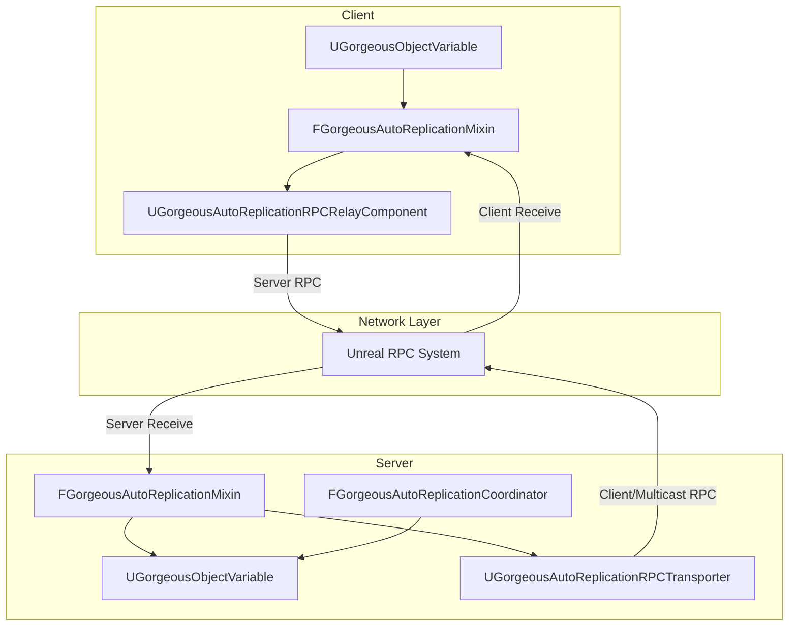
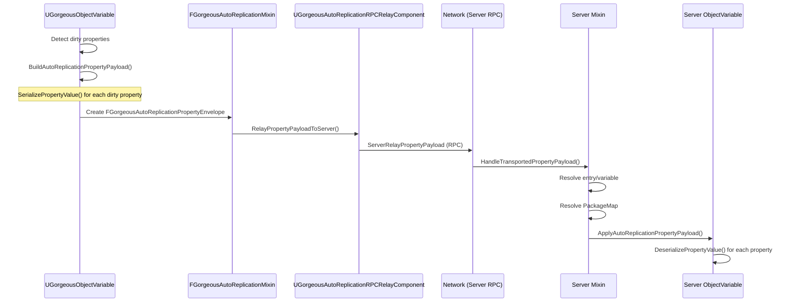
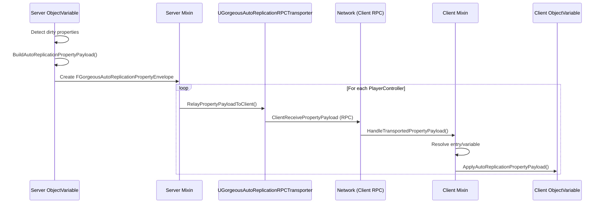
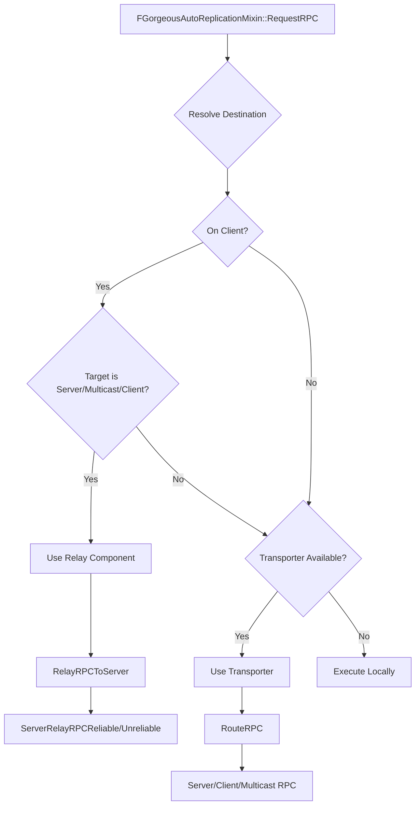
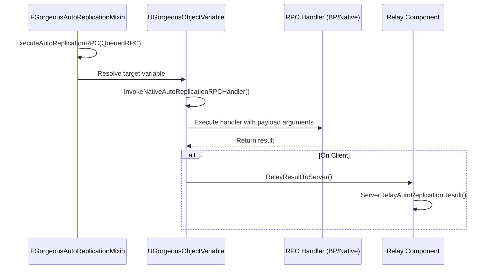

# 🔁 AutoReplication — Architecture & Flow

???+ info "Short Description"

    This document provides a comprehensive technical overview of the AutoReplication system, including the end-to-end replication flow, serialization mechanisms, and component responsibilities.

??? info "Long Description"

    AutoReplication is Gorgeous Core's networking layer for Object Variables. It enables property streaming and RPC-style payloads with client/server routing without requiring manual replication setup. The system uses a mixin-based design that binds to Quality-of-Life classes (Game State, Player Controller, Player State, World Settings) and handles runtime replication through coordinator, relay, and transporter components.

## 🏗️ System Architecture



## 🔄 Core Concepts

### Payload Types

| Type | Description |
| :--- | :---------- |
| `FGorgeousAutoReplicationPropertyValue` | Serialized bytes for a single registered property, with replication mode + condition |
| `FGorgeousAutoReplicationPropertyPayload` | A batch of property values for a stream |
| `FGorgeousAutoReplicationPropertyEnvelope` | Payload + EntryKey used to resolve the target variable on the receiver |
| `FGorgeousQueuedRPC` | Serialized RPC waiting to be dispatched |
| `FGorgeousRPCPayload` | Handler name + arguments for RPC invocation |

### Serialization Modes

Property values are serialized by `UGorgeousObjectVariable` using one of three strategies:

=== "Property Mode"
    ```cpp
    // EGorgeousReplicationMode::EProperty
    // Uses FProperty::SerializeItem for standard property serialization
    FProperty->SerializeItem(FStructuredArchiveSlot, PropertyAddress);
    ```

=== "NetSerialize Mode"
    ```cpp
    // EGorgeousReplicationMode::ENetSerialize
    // Uses FProperty::NetSerializeItem for network-optimized serialization
    FProperty->NetSerializeItem(FArchive, PackageMap, PropertyAddress);
    ```

=== "Custom Payload Mode"
    ```cpp
    // EGorgeousReplicationMode::ECustomPayload
    // Calls Blueprint/C++ overridable function
    BuildCustomAutoReplicationPayload(PropertyName, OutPayload, bIsInitialState);
    ```

### Transporters vs Relay

!!! info "Key Distinction"
    
    **Neither performs serialization** — they only move already-serialized envelopes and RPC structs.

| Component | Direction | Purpose |
| :-------- | :-------- | :------ |
| `UGorgeousAutoReplicationRPCRelayComponent` | Client → Server | Default subobject for property and RPC routing when transporter is unavailable |
| `UGorgeousAutoReplicationRPCTransporter` | Server ↔ Client/Multicast | Handles server, client, and multicast routing for RPCs and property payloads |

---

## 📤 Property Replication Flow

### Client → Server (Dirty Property Sync)



### Server → Client(s) (Authoritative Update)



### Call Tree: Client → Server

```
UGorgeousObjectVariable::TryClientSyncDirtyProperties
 ├─ BuildAutoReplicationPropertyPayload
 │   └─ GorgeousObjectVariable_Private::SerializePropertyValue
 ├─ Filter by DirtyProperties
 ├─ Build FGorgeousAutoReplicationPropertyEnvelope
 └─ UGorgeousAutoReplicationRPCRelayComponent::RelayPropertyPayloadToServer
     └─ ServerRelayPropertyPayload (RPC)
         └─ FGorgeousAutoReplicationMixin::HandleTransportedPropertyPayload
             ├─ Resolve entry/variable
             ├─ Resolve PackageMap
             └─ UGorgeousObjectVariable::ApplyAutoReplicationPropertyPayload
                 └─ GorgeousObjectVariable_Private::DeserializePropertyValue
```

### Call Tree: Server → Client

```
UGorgeousObjectVariable::TryServerReplicateProperties
 ├─ BuildAutoReplicationPropertyPayload
 │   └─ GorgeousObjectVariable_Private::SerializePropertyValue
 ├─ Filter by DirtyProperties
 ├─ Build FGorgeousAutoReplicationPropertyEnvelope
 └─ For each PlayerController:
     └─ UGorgeousAutoReplicationRPCRelayComponent::RelayPropertyPayloadToClient
         └─ ClientRelayPropertyPayload (RPC)
             └─ FGorgeousAutoReplicationMixin::HandleTransportedPropertyPayload
                 ├─ Resolve entry/variable
                 ├─ Resolve PackageMap
                 └─ UGorgeousObjectVariable::ApplyAutoReplicationPropertyPayload
                     └─ GorgeousObjectVariable_Private::DeserializePropertyValue
```

---

## 📡 RPC Replication Flow

### Dispatching an AutoReplication RPC



### RPC Call Tree

```
FGorgeousAutoReplicationMixin::RequestRPC
 ├─ ResolveRPCDestination
 ├─ Build FGorgeousQueuedRPC
 ├─ If client + server/client/multicast target:
 │   └─ UGorgeousAutoReplicationRPCRelayComponent::RelayRPCToServer
 │       └─ ServerRelayRPCReliable/Unreliable (RPC)
 │           ├─ HandleTransportedRPC (server-bound)
 │           └─ RequestRPC (client/multicast re-route via transporter)
 └─ Else:
     └─ UGorgeousAutoReplicationRPCTransporter::RouteRPC
         ├─ ServerReceiveRPCReliable/Unreliable (RPC)
         ├─ ClientReceiveRPCReliable/Unreliable (RPC)
         └─ MulticastReceiveRPCReliable/Unreliable (RPC)
             └─ DeliverRPCLocally → HandleTransportedRPC → ExecuteAutoReplicationRPC
```

### Execution on Receiver



---

## 🔌 Component Reference

### FGorgeousAutoReplicationMixin

The mixin is the central binding that connects an owning object to the AutoReplication system.

| Method | Description |
| :----- | :---------- |
| `Bind()` | Binds the mixin to owner and storage containers |
| `InitializeAdditionalData()` | Initializes data container and activates networking |
| `FindEntry()` | Finds an entry by key |
| `TrySetReplicatedValue()` | Sets a replicated value |
| `TryGetValue()` | Resolves a value for a key |
| `GetOrAssignReplicationIndex()` | Maps key to replication index |
| `RefreshCachedValues()` | Rebuilds caches after OnRep |
| `RequestRPC()` | Queues an async RPC request |
| `ExecuteAutoReplicationRPC()` | Executes a queued RPC |
| `DequeuePendingRPC()` | Pops next queued RPC for Blueprint processing |
| `DispatchPendingRPCs()` | Drains pending queue |

### UGorgeousAutoReplicationRPCRelayComponent

Lives on each PlayerController to shuttle results and payloads.

| Method | Description |
| :----- | :---------- |
| `RelayResultToServer()` | Forwards local result to authority |
| `RelayPropertyPayloadToServer()` | Relays property payload client → server |
| `RelayPropertyPayloadToClient()` | Relays property payload server → client |
| `RelayRPCToServer()` | Relays RPC client → server |

### UGorgeousAutoReplicationRPCTransporter

Routes RPC payloads across desired network targets.

| Method | Description |
| :----- | :---------- |
| `InitializeTransporter()` | Binds to owning mixin |
| `RouteRPC()` | Routes RPC using encoded direction |
| `RoutePropertyPayload()` | Routes property payload |
| `SetClientTargetOverride()` | Temporary override for client target |

### FGorgeousAutoReplicationCoordinator

Coordinates auto-replication features including Iris and Replication Graph.

| Method | Description |
| :----- | :---------- |
| `Get()` | Gets coordinator for world |
| `Initialize()` | Initializes coordinator |
| `RegisterObjectVariable()` | Registers variable for replication |
| `UnregisterObjectVariable()` | Unregisters variable |
| `SetUseIrisOverride()` | Runtime override for Iris |
| `SetReplicationGraphEnabledOverride()` | Runtime override for RepGraph |

---

## ⚠️ Important Notes

!!! warning "Serialization Location"
    
    Serialization occurs **only** in `UGorgeousObjectVariable::BuildAutoReplicationPropertyPayload` (and deserialization in `ApplyAutoReplicationPropertyPayload`). The relay and transporter **only forward** the already-serialized envelopes and never run serialization logic themselves.

!!! tip "Access Policy"
    
    When `FGorgeousAutoReplicationStreamConfig::bRespectAccessPolicy` is enabled, the system will evaluate `UGorgeousObjectVariable::ResolveRespectAccessPolicy()` to determine if a connection should receive updates.
