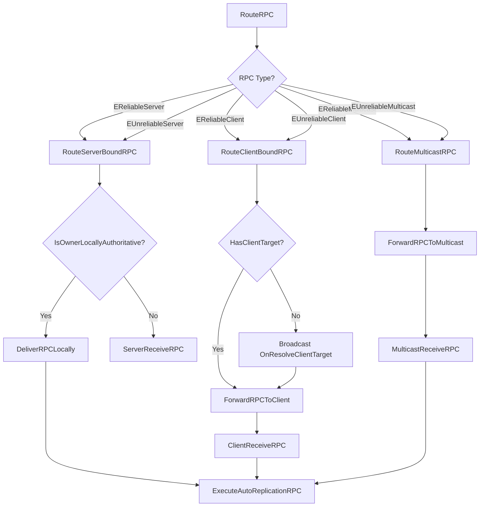
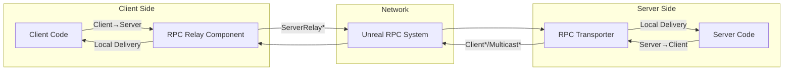

# 📡 AutoReplication Components

???+ info "Short Description"

    This page documents the Relay and Transporter components that handle network transport for AutoReplication RPCs and property payloads.

??? info "Long Description"

    The AutoReplication system uses two component types for network communication:
    
    - **UGorgeousAutoReplicationRPCRelayComponent**: Lives on each PlayerController, shuttles client RPCs and property payloads to the server
    - **UGorgeousAutoReplicationRPCTransporter**: Server-authoritative component that routes RPCs in all directions (Server, Client, Multicast)
    
    Neither component performs serialization — they only move already-serialized envelopes and RPC structs.

---

## 🔄 UGorgeousAutoReplicationRPCRelayComponent

The Relay Component is automatically created on each PlayerController and handles client-to-server communication.

---

### Functions

#### RelayResultToServer

Forwards a local RPC result to the authority for async request aggregation.

=== "📝 Function Details"

    | Property | Value |
    | :------- | :---- |
    | **Category** | `Gorgeous Core\|AutoReplication\|Networking` |
    | **Access** | `Public` |
    | **Callable From** | `Blueprint`, `C++` |

    **Inputs**

    | Name | Type | Description |
    | :--- | :--- | :---------- |
    | `Result` | `const FGorgeousAutoReplicationRPCResult&` | The RPC result to relay |

    **Outputs**

    | Name | Type | Description |
    | :--- | :--- | :---------- |
    | *(None)* | `void` | — |

=== "📚 Usage Examples"

    ```cpp title="C++ Example"
    // Called automatically by ExecuteAutoReplicationRPC when on client
    void NotifyResultToAuthority(const FGorgeousAutoReplicationRPCResult& Result)
    {
        if (UGorgeousAutoReplicationRPCRelayComponent* Relay = 
            LocalController->FindComponentByClass<UGorgeousAutoReplicationRPCRelayComponent>())
        {
            Relay->RelayResultToServer(Result);
        }
    }
    ```

---

#### RelayPropertyPayloadToServer

Relays a property payload from client to server.

=== "📝 Function Details"

    | Property | Value |
    | :------- | :---- |
    | **Category** | `Gorgeous Core\|AutoReplication\|Networking` |
    | **Access** | `Public` |
    | **Callable From** | `C++` |

    **Inputs**

    | Name | Type | Description |
    | :--- | :--- | :---------- |
    | `Envelope` | `const FGorgeousAutoReplicationPropertyEnvelope&` | Serialized property payload with routing info |
    | `TargetMixin` | `FGorgeousAutoReplicationMixin*` | Mixin to receive the payload on the server |

    **Outputs**

    | Name | Type | Description |
    | :--- | :--- | :---------- |
    | `Return` | `bool` | `true` if relay was initiated |

=== "📚 Usage Examples"

    ```cpp title="C++ Example"
    // Sync dirty client properties to server
    FGorgeousAutoReplicationPropertyEnvelope Envelope;
    Envelope.EntryKey = TEXT("PlayerInventory");
    Envelope.Payload = BuildPropertyPayload();
    
    if (RelayComponent->RelayPropertyPayloadToServer(Envelope, &GameStateMixin))
    {
        UE_LOG(LogTemp, Log, TEXT("Property payload relayed to server"));
    }
    ```

---

#### RelayPropertyPayloadToClient

Relays a property payload from server to the owning client.

=== "📝 Function Details"

    | Property | Value |
    | :------- | :---- |
    | **Category** | `Gorgeous Core\|AutoReplication\|Networking` |
    | **Access** | `Public` |
    | **Callable From** | `C++` |

    **Inputs**

    | Name | Type | Description |
    | :--- | :--- | :---------- |
    | `Envelope` | `const FGorgeousAutoReplicationPropertyEnvelope&` | Serialized property payload |

    **Outputs**

    | Name | Type | Description |
    | :--- | :--- | :---------- |
    | `Return` | `bool` | `true` if relay was initiated |

=== "📚 Usage Examples"

    ```cpp title="C++ Example"
    // Send authoritative state to specific client
    for (APlayerController* PC : World->GetPlayerControllerIterator())
    {
        if (auto* Relay = PC->FindComponentByClass<UGorgeousAutoReplicationRPCRelayComponent>())
        {
            Relay->RelayPropertyPayloadToClient(Envelope);
        }
    }
    ```

---

#### RelayRPCToServer

Relays an RPC from client to server.

=== "📝 Function Details"

    | Property | Value |
    | :------- | :---- |
    | **Category** | `Gorgeous Core\|AutoReplication\|Networking` |
    | **Access** | `Public` |
    | **Callable From** | `C++` |

    **Inputs**

    | Name | Type | Description |
    | :--- | :--- | :---------- |
    | `QueuedRPC` | `const FGorgeousQueuedRPC&` | The RPC to relay |
    | `bReliable` | `bool` | Whether to use reliable transport |
    | `TargetMixin` | `FGorgeousAutoReplicationMixin*` | Mixin to execute the RPC |

    **Outputs**

    | Name | Type | Description |
    | :--- | :--- | :---------- |
    | `Return` | `bool` | `true` if relay was initiated |

=== "📚 Usage Examples"

    ```cpp title="C++ Example"
    FGorgeousQueuedRPC RPC;
    RPC.Key = TEXT("ScoreManager");
    RPC.Type = EGorgeousAutoReplicationRPCType::EReliableServer;
    RPC.Payload.HandlerName = TEXT("OnPlayerScored");
    
    RelayComponent->RelayRPCToServer(RPC, /*bReliable=*/true, &GameStateMixin);
    ```

---

### Internal RPC Functions

| Function | Direction | Reliability | Purpose |
| :------- | :-------- | :---------- | :------ |
| `ServerRelayAutoReplicationResult` | Client → Server | Reliable | Aggregates async RPC results |
| `ServerRelayPropertyPayload` | Client → Server | Reliable | Syncs client property changes |
| `ServerRelayRPCReliable` | Client → Server | Reliable | Server-bound RPC (guaranteed) |
| `ServerRelayRPCUnreliable` | Client → Server | Unreliable | Server-bound RPC (best effort) |
| `ClientRelayPropertyPayload` | Server → Client | Reliable | Sends authoritative state |

---

## 🚀 UGorgeousAutoReplicationRPCTransporter

The Transporter Component is created by the server and replicates to clients. It handles all RPC routing directions.

---

### Functions

#### InitializeTransporter

Binds the transporter to a mixin for local payload delivery.

=== "📝 Function Details"

    | Property | Value |
    | :------- | :---- |
    | **Category** | `Gorgeous Core\|AutoReplication\|Networking` |
    | **Access** | `Public` |
    | **Callable From** | `C++` |

    **Inputs**

    | Name | Type | Description |
    | :--- | :--- | :---------- |
    | `InOwningMixin` | `FGorgeousAutoReplicationMixin*` | The mixin to bind |

    **Outputs**

    | Name | Type | Description |
    | :--- | :--- | :---------- |
    | *(None)* | `void` | — |

=== "📚 Usage Examples"

    ```cpp title="C++ Example"
    // Called automatically by FGorgeousAutoReplicationMixin::InitializeTransporter()
    UGorgeousAutoReplicationRPCTransporter* Transporter = 
        NewObject<UGorgeousAutoReplicationRPCTransporter>(OwnerActor);
    Transporter->InitializeTransporter(&AutoReplicationMixin);
    ```

---

#### RouteRPC

Routes an RPC based on its encoded direction.

=== "📝 Function Details"

    | Property | Value |
    | :------- | :---- |
    | **Category** | `Gorgeous Core\|AutoReplication\|Networking` |
    | **Access** | `Public` |
    | **Callable From** | `C++` |

    **Inputs**

    | Name | Type | Description |
    | :--- | :--- | :---------- |
    | `QueuedRPC` | `const FGorgeousQueuedRPC&` | The RPC to route |

    **Outputs**

    | Name | Type | Description |
    | :--- | :--- | :---------- |
    | `Return` | `bool` | `true` if routing was successful |

=== "📚 Usage Examples"

    ```cpp title="C++ Example"
    FGorgeousQueuedRPC RPC;
    RPC.Type = EGorgeousAutoReplicationRPCType::EReliableMulticast;
    RPC.Payload.HandlerName = TEXT("OnGlobalEvent");
    
    if (Transporter->RouteRPC(RPC))
    {
        UE_LOG(LogTemp, Log, TEXT("RPC routed to all clients"));
    }
    ```



---

#### RoutePropertyPayload

Routes a property payload using the specified route type.

=== "📝 Function Details"

    | Property | Value |
    | :------- | :---- |
    | **Category** | `Gorgeous Core\|AutoReplication\|Networking` |
    | **Access** | `Public` |
    | **Callable From** | `C++` |

    **Inputs**

    | Name | Type | Description |
    | :--- | :--- | :---------- |
    | `Envelope` | `const FGorgeousAutoReplicationPropertyEnvelope&` | The payload to route |
    | `RouteType` | `EGorgeousAutoReplicationRPCType` | Routing direction |

    **Outputs**

    | Name | Type | Description |
    | :--- | :--- | :---------- |
    | `Return` | `bool` | `true` if routing was successful |

---

#### SetClientTargetOverride

Sets a temporary override for the next client-bound RPC.

=== "📝 Function Details"

    | Property | Value |
    | :------- | :---- |
    | **Category** | `Gorgeous Core\|AutoReplication\|Networking` |
    | **Access** | `Public` |
    | **Callable From** | `Blueprint`, `C++` |

    **Inputs**

    | Name | Type | Description |
    | :--- | :--- | :---------- |
    | `InPlayerController` | `APlayerController*` | The target controller |

    **Outputs**

    | Name | Type | Description |
    | :--- | :--- | :---------- |
    | *(None)* | `void` | — |

=== "📚 Usage Examples"

    === "Blueprint"
        
        
        
    === "C++"
        
        ```cpp title="C++ Example"
        // Send RPC to specific player
        Transporter->SetClientTargetOverride(TargetPlayerController);
        Mixin.RequestRPC(TEXT("Key"), EGorgeousAutoReplicationRPCType::EReliableClient, Payload,
                         EGorgeousAutoReplicationTargetKind::EObjectVariable);
        // Override auto-clears after use
        ```

---

#### ClearClientTargetOverride

Clears any pending client target override.

=== "📝 Function Details"

    | Property | Value |
    | :------- | :---- |
    | **Category** | `Gorgeous Core\|AutoReplication\|Networking` |
    | **Access** | `Public` |
    | **Callable From** | `Blueprint`, `C++` |

    **Inputs**

    | Name | Type | Description |
    | :--- | :--- | :---------- |
    | *(None)* | — | — |

    **Outputs**

    | Name | Type | Description |
    | :--- | :--- | :---------- |
    | *(None)* | `void` | — |

---

### Delegates

#### OnResolveClientTarget

Broadcast when a client target is needed for RPC routing but none is set.

```cpp
DECLARE_DYNAMIC_MULTICAST_DELEGATE_TwoParams(
    FGorgeousAutoReplicationRequestClientTargetSignature,
    UGorgeousAutoReplicationRPCTransporter*, Transporter,
    const FGorgeousQueuedRPC&, QueuedRPC);
```

=== "📚 Usage Examples"

    === "Blueprint"
        
        

    === "C++"
        
        ```cpp title="C++ Example"
        Transporter->OnResolveClientTarget.AddDynamic(this, &AMyActor::HandleResolveClientTarget);

        void AMyActor::HandleResolveClientTarget(UGorgeousAutoReplicationRPCTransporter* Trans,
                                                  const FGorgeousQueuedRPC& RPC)
        {
            // Find appropriate client and set override
            APlayerController* Target = FindTargetForRPC(RPC);
            Trans->SetClientTargetOverride(Target);
        }
        ```

---

#### OnRPCForwarded

Broadcast after an RPC has been forwarded to a remote endpoint.

```cpp
DECLARE_DYNAMIC_MULTICAST_DELEGATE_TwoParams(
    FGorgeousAutoReplicationRPCRoutedSignature,
    const FGorgeousQueuedRPC&, QueuedRPC,
    UObject*, Target);
```

=== "📚 Usage Examples"

    ```cpp title="C++ Example"
    Transporter->OnRPCForwarded.AddDynamic(this, &AMyActor::OnRPCForwarded);

    void AMyActor::OnRPCForwarded(const FGorgeousQueuedRPC& RPC, UObject* Target)
    {
        UE_LOG(LogTemp, Log, TEXT("RPC %s forwarded to %s"), 
               *RPC.Payload.HandlerName.ToString(),
               Target ? *Target->GetName() : TEXT("multicast"));
    }
    ```

---

### Internal RPC Functions

| Function | Direction | Reliability | Purpose |
| :------- | :-------- | :---------- | :------ |
| `ServerReceiveRPCReliable` | Client → Server | Reliable | Receives server-bound RPC |
| `ServerReceiveRPCUnreliable` | Client → Server | Unreliable | Receives server-bound RPC |
| `ClientReceiveRPCReliable` | Server → Client | Reliable | Receives client-bound RPC |
| `ClientReceiveRPCUnreliable` | Server → Client | Unreliable | Receives client-bound RPC |
| `MulticastReceiveRPCReliable` | Server → All | Reliable | Receives multicast RPC |
| `MulticastReceiveRPCUnreliable` | Server → All | Unreliable | Receives multicast RPC |
| `ServerReceivePropertyPayloadReliable` | Client → Server | Reliable | Property sync |
| `ServerReceivePropertyPayloadUnreliable` | Client → Server | Unreliable | Property sync |
| `ClientReceivePropertyPayloadReliable` | Server → Client | Reliable | Property sync |
| `ClientReceivePropertyPayloadUnreliable` | Server → Client | Unreliable | Property sync |
| `MulticastReceivePropertyPayloadReliable` | Server → All | Reliable | Property broadcast |
| `MulticastReceivePropertyPayloadUnreliable` | Server → All | Unreliable | Property broadcast |

---

## 🔀 Relay vs Transporter Comparison



| Aspect | Relay Component | Transporter Component |
| :----- | :-------------- | :-------------------- |
| **Location** | Each PlayerController | Owner Actor (GameState, etc.) |
| **Creation** | Automatic on PlayerController | Server-created, replicates to clients |
| **Primary Direction** | Client → Server | Server → Client, Multicast |
| **Server RPCs** | Uses `ServerRelay*` | Uses `ServerReceive*` |
| **Client RPCs** | Receives via `ClientRelay*` | Sends via `ClientReceive*` |
| **Multicast RPCs** | N/A | Uses `MulticastReceive*` |

---

## ⚠️ Important Notes

!!! warning "Transporter Replication"
    
    The Transporter component **must** be created by the server and replicate to clients. Clients cannot create their own transporters because the server counterpart is needed for RPC reception.

!!! info "Relay Fallback"
    
    When a Transporter is not available (e.g., early in initialization), the Mixin falls back to using the Relay component for server-bound RPCs.

!!! tip "Client Target Resolution"
    
    For client-bound RPCs, bind to `OnResolveClientTarget` to dynamically select the target. Alternatively, use `SetClientTargetOverride()` before calling `RequestRPC()`.
