# 🔬 AutoReplication Deep Dive

???+ info "Overview"

    This document provides an in-depth technical exploration of the AutoReplication system's architecture, data flow, and internal mechanisms. It's intended for developers who need to understand the system at the implementation level.

---

## 🏗️ Architectural Philosophy

The AutoReplication system is designed around three core principles:

1. **Separation of Concerns**: Serialization happens only in Object Variables, while transport is handled by dedicated components
2. **Mixin-Based Binding**: Non-invasive attachment to existing QoL classes without inheritance requirements
3. **Dual-Path Routing**: Client→Server uses Relay components; Server→Client/Multicast uses Transporter components

```mermaid
graph TB
    subgraph "Design Layers"
        L1[Application Layer<br/>Object Variables & Handlers]
        L2[Binding Layer<br/>Mixin & Entries]
        L3[Transport Layer<br/>Relay & Transporter]
        L4[Network Layer<br/>Unreal RPC System]
    end
    
    L1 --> L2
    L2 --> L3
    L3 --> L4
    
    style L1 fill:#4a5568
    style L2 fill:#2d3748
    style L3 fill:#1a202c
    style L4 fill:#0d1117
```

---

## 🔄 Data Flow Architecture

### Property Replication Pipeline

The property replication pipeline transforms in-memory property values into network-transportable byte arrays and back.

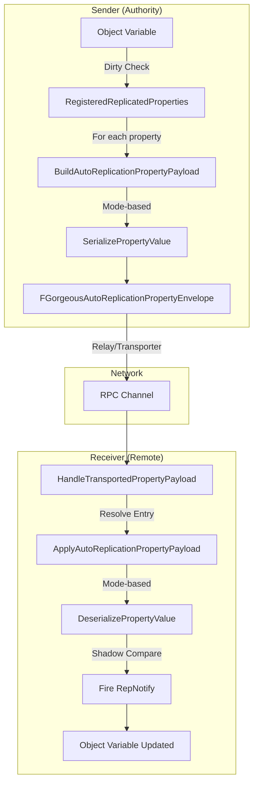

### Serialization Mode Decision Tree

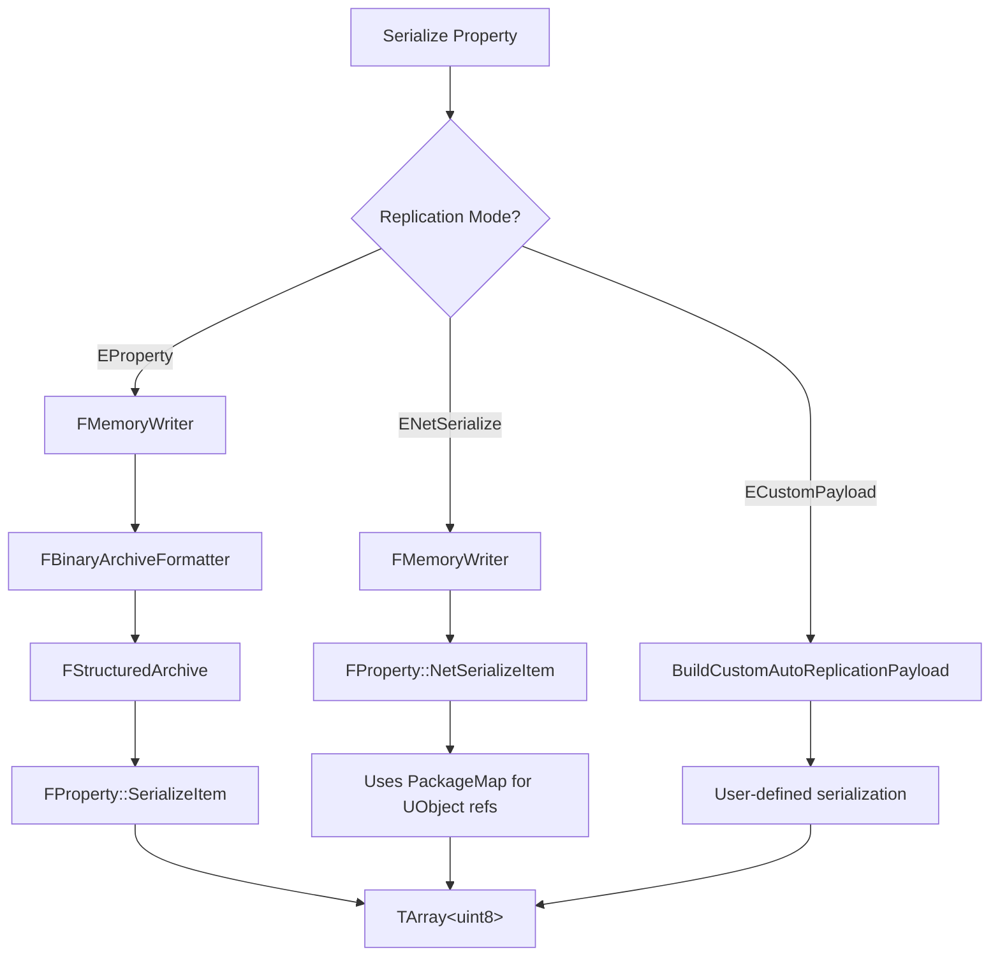

---

## 🎯 RPC Routing Engine

### Route Resolution Algorithm

When an RPC is requested, the system must determine the optimal routing path:

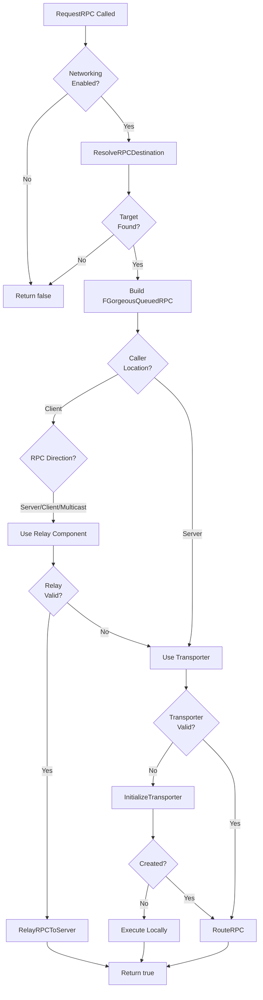

### RPC Type Routing Matrix

| RPC Type | Client Caller | Server Caller |
|:---------|:--------------|:--------------|
| `ReliableServer` | Relay → Server | Execute Locally |
| `UnreliableServer` | Relay → Server | Execute Locally |
| `ReliableClient` | Relay → Server → Client | Transporter → Client |
| `UnreliableClient` | Relay → Server → Client | Transporter → Client |
| `ReliableMulticast` | Relay → Server → All | Transporter → All |
| `UnreliableMulticast` | Relay → Server → All | Transporter → All |

### RPC Handler Invocation

When an RPC arrives at its target, the system must resolve and invoke the appropriate handler function:

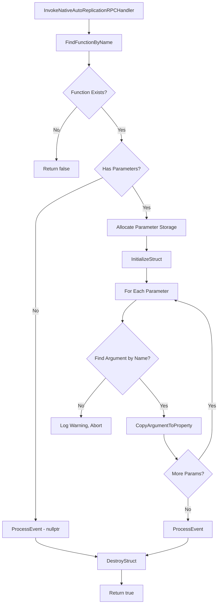

### Argument Type Matching

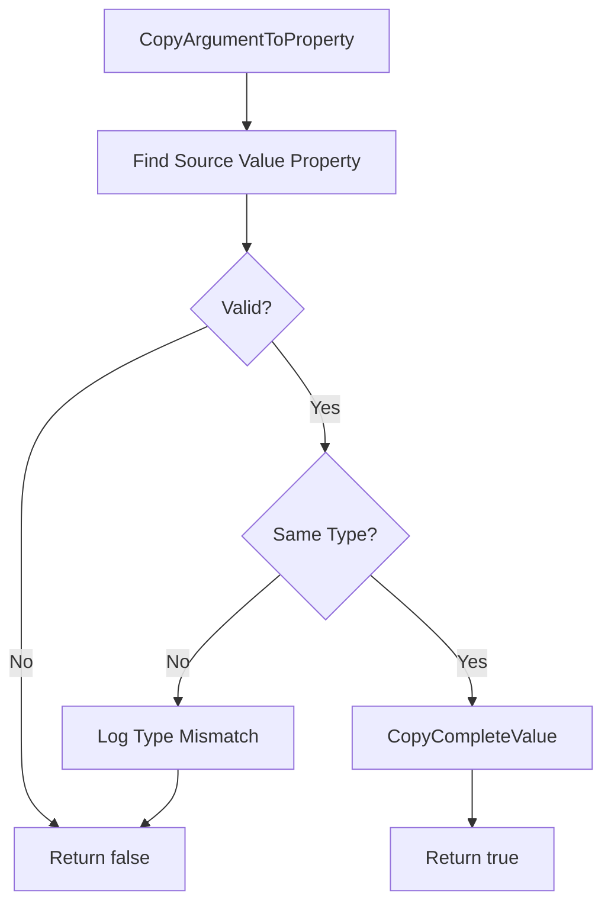

---

## 🔗 Mixin Binding Mechanism

### Binding Lifecycle

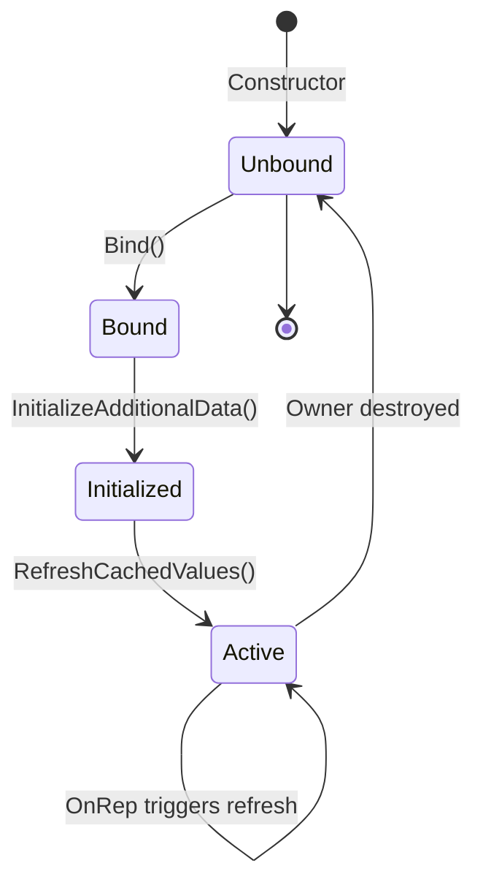

### Entry Resolution Flow

The mixin maintains two parallel data structures that must stay synchronized:

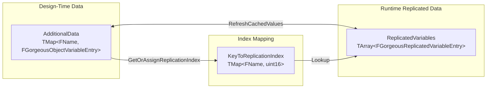

### Handle Caching Strategy

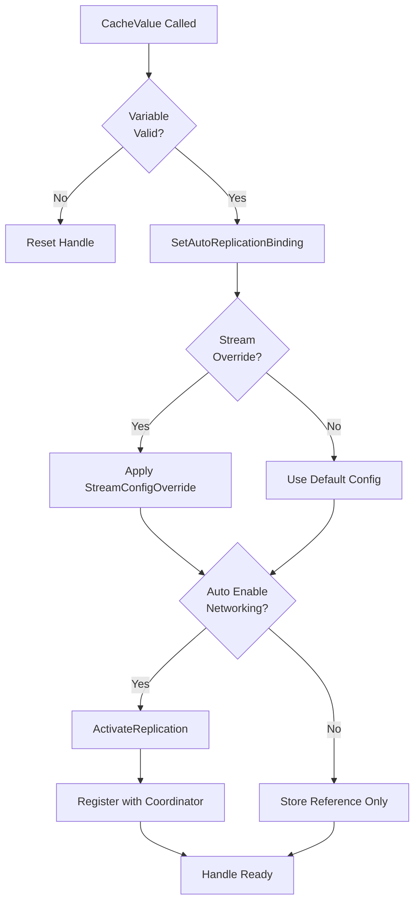

---

## 🌐 Network Topology

### Component Distribution

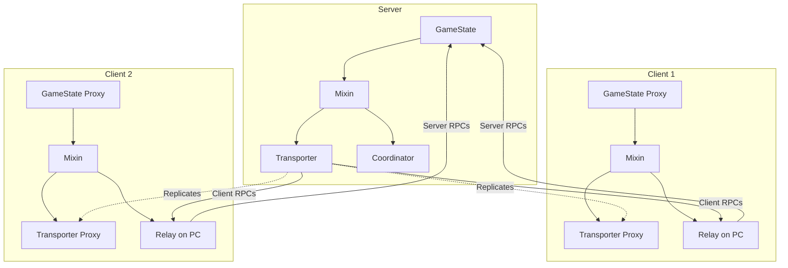

### RPC Execution Sequence

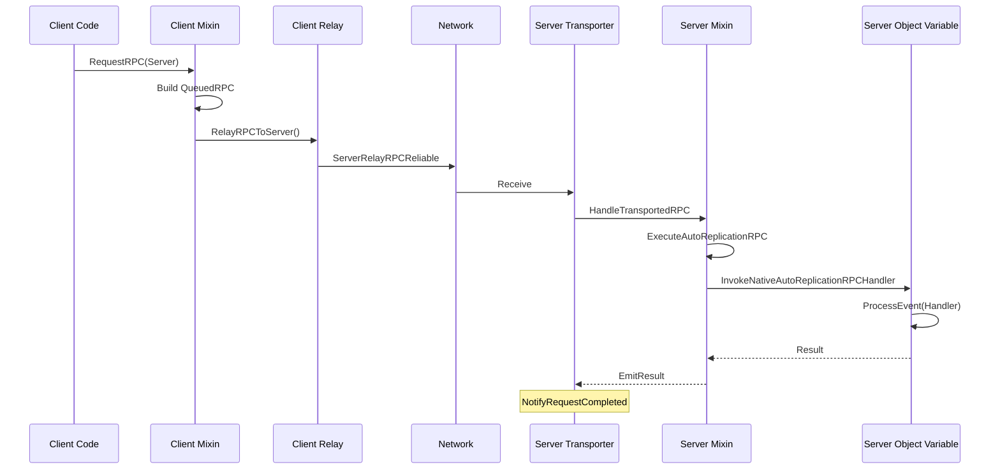

---

## 🔒 Thread Safety Considerations

### Concurrent Access Points

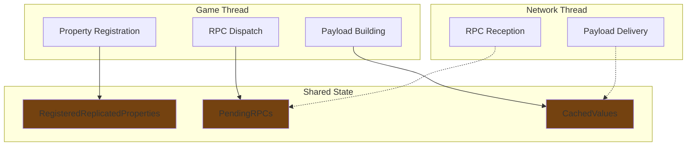

!!! warning "Threading Model"
    
    AutoReplication assumes single-threaded access from the Game Thread. All network callbacks are marshaled to the Game Thread before processing. Do not access mixin state from async tasks.

---

## 📊 Performance Characteristics

### Payload Size Estimation

```
PropertyPayload Size = Σ(PropertySize + MetadataOverhead)
  where MetadataOverhead ≈ 32 bytes per property
    - FName: 8 bytes
    - Mode: 1 byte
    - Condition: 1 byte
    - Flags: 2 bytes
    - Length prefix: 4 bytes
    - Padding: ~16 bytes
```

### Replication Index Capacity

- Maximum entries per mixin: **65,534** (uint16 - 1 for invalid)
- Index assignment: Sequential, never reused during session
- Overflow behavior: Ensure fires, returns InvalidReplicationIndex

### Memory Footprint

| Component | Approximate Size |
|:----------|:-----------------|
| Mixin (base) | ~128 bytes |
| Per entry overhead | ~64 bytes |
| Transporter component | ~256 bytes |
| Relay component | ~128 bytes |
| Per queued RPC | ~96 bytes + payload |

---

## 🧪 Debugging Internals

### Diagnostic Checklist

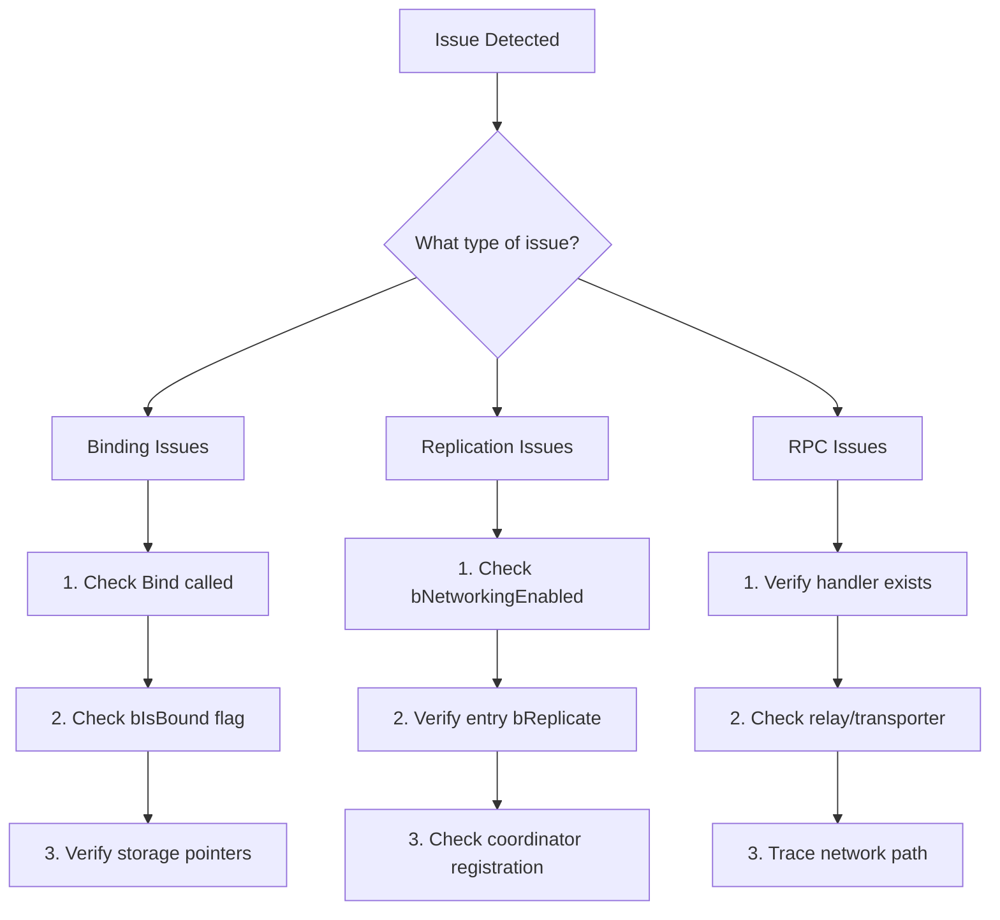

---

## ⚙️ Configuration Points

### Stream Configuration Hierarchy

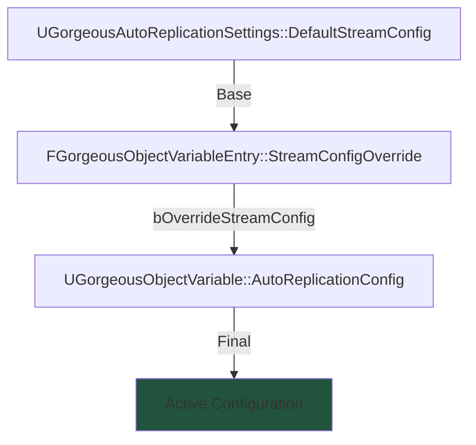

### Runtime Override Points

| Setting | Location | Scope |
|:--------|:---------|:------|
| Default stream config | Project Settings | Global |
| Entry stream override | QoL class definition | Per-entry |
| Variable config | Object Variable instance | Per-variable |
| Access policy | `SetNetworkAccessPolicy()` | Per-variable |
| Respect access | `SetAutoReplicationRespectAccessPolicy()` | Per-variable |

---

## 🔮 Extension Points

### Custom Serialization

Override `BuildCustomAutoReplicationPayload` and `ApplyCustomAutoReplicationPayload` in your Object Variable class to implement custom serialization logic.

### Custom RPC Handlers

Implement functions matching the handler name in your Object Variable class. The system uses reflection to invoke handlers with automatic argument binding.

### Custom Transporter Routing

Subclass `UGorgeousAutoReplicationRPCTransporter` and override the virtual routing functions to implement custom routing logic.

### Coordinator Integration

Access `FGorgeousAutoReplicationCoordinator::Get(World)` for Iris/RepGraph integration points.

---

## ⚠️ Known Limitations

!!! danger "Critical Constraints"
    
    1. **No cross-world replication**: Variables must exist in the same UWorld context
    2. **No late binding**: Entries must be configured before `InitializeAdditionalData()`
    3. **No transporter without authority**: Clients cannot create transporters
    4. **PackageMap required for UObject refs**: ENetSerialize mode needs valid connection

!!! info "Design Tradeoffs"
    
    - Favors simplicity over micro-optimizations
    - Prioritizes debuggability over minimal bandwidth
    - Assumes reliable ordering for property payloads
