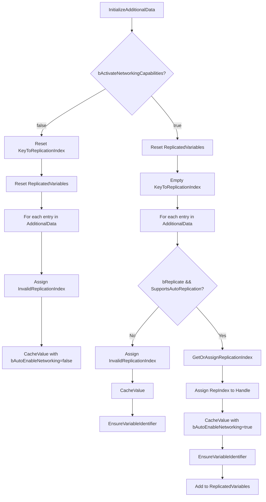
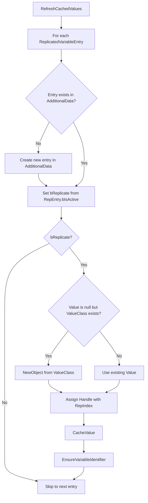
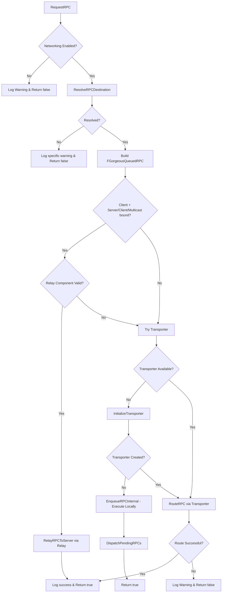
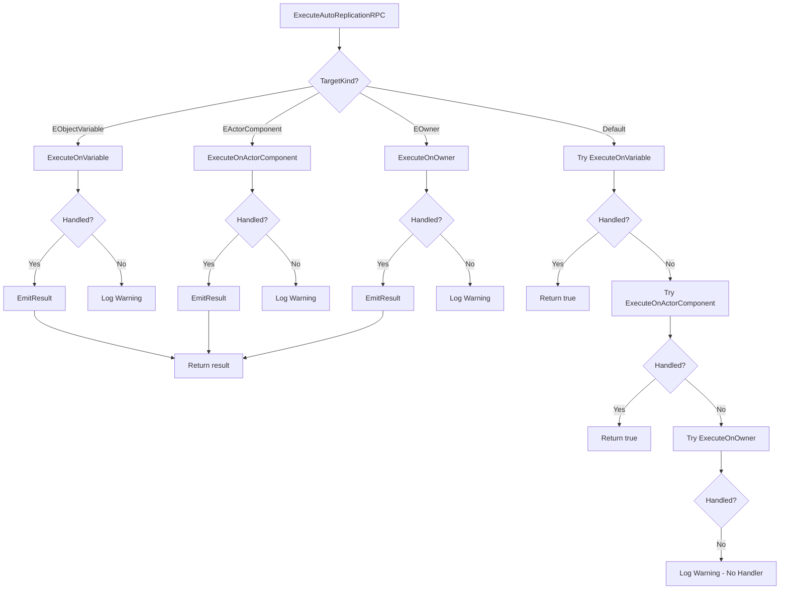

# 🔌 FGorgeousAutoReplicationMixin

???+ info "Short Description"

    The AutoReplication Mixin is the central binding struct that connects Quality-of-Life classes to the AutoReplication system, managing object variable entries, replication indices, and RPC dispatching.

??? info "Long Description"

    `FGorgeousAutoReplicationMixin` is a non-UObject struct that provides the core AutoReplication functionality to QoL classes like `AGorgeousGameState`, `AGorgeousPlayerController`, `AGorgeousPlayerState`, and `AGorgeousWorldSettings`. It maintains mappings between entry keys and replication indices, caches object variable references, and coordinates with the relay and transporter components for network communication.

## 🔧 Functions

### Bind

Binds the mixin to an owner object and storage containers.

=== "📝 Function Details"

    | Property | Value |
    | :------- | :---- |
    | **Category** | `Gorgeous AutoReplication` |
    | **Access** | `Public` |
    | **Callable From** | `C++` |

    **Inputs**

    | Name | Type | Description |
    | :--- | :--- | :---------- |
    | `InOwner` | `UObject*` | The owning QoL object (GameState, PlayerController, etc.) |
    | `InAdditionalData` | `TMap<FName, FGorgeousObjectVariableEntry>*` | Pointer to the entry map container |
    | `InReplicatedVariables` | `TArray<FGorgeousReplicatedVariableEntry>*` | Pointer to the replicated entries array |

    **Outputs**

    | Name | Type | Description |
    | :--- | :--- | :---------- |
    | *(None)* | `void` | — |

=== "📚 Usage Examples"

    ```cpp title="C++ Example"
    // Inside AGorgeousGameState constructor
    void AGorgeousGameState::PostInitializeComponents()
    {
        Super::PostInitializeComponents();
        
        // Bind mixin to this GameState
        AutoReplicationMixin.Bind(
            this,
            &AdditionalData,
            &ReplicatedVariables
        );
        
        // Enable networking
        AutoReplicationMixin.InitializeAdditionalData(true);
    }
    ```

!!! note "Internal State"
    
    After calling `Bind()`, the mixin sets `bIsBound = true` only if all parameters are valid. The transporter initialization is also triggered.

---

### InitializeAdditionalData

Initializes the additional data container and optionally activates networking capabilities.

=== "📝 Function Details"

    | Property | Value |
    | :------- | :---- |
    | **Category** | `Gorgeous AutoReplication` |
    | **Access** | `Public` |
    | **Callable From** | `C++` |

    **Inputs**

    | Name | Type | Description |
    | :--- | :--- | :---------- |
    | `bActivateNetworkingCapabilities` | `bool` | Whether to enable networking features |

    **Outputs**

    | Name | Type | Description |
    | :--- | :--- | :---------- |
    | *(None)* | `void` | — |

=== "📚 Usage Examples"

    ```cpp title="C++ Example"
    // Enable networking for all entries
    AutoReplicationMixin.InitializeAdditionalData(true);
    
    // Or disable networking (local-only mode)
    AutoReplicationMixin.InitializeAdditionalData(false);
    ```

!!! warning "Networking Mode"
    
    When `bActivateNetworkingCapabilities` is `false`, all entries will have `InvalidReplicationIndex` and the `ReplicatedVariables` array will be empty. This mode is useful for single-player or local-only scenarios.



---

### FindEntry

Finds an entry by its key.

=== "📝 Function Details"

    | Property | Value |
    | :------- | :---- |
    | **Category** | `Gorgeous AutoReplication` |
    | **Access** | `Public` |
    | **Callable From** | `C++` |

    **Inputs**

    | Name | Type | Description |
    | :--- | :--- | :---------- |
    | `Key` | `FName` | The entry key to search for |

    **Outputs**

    | Name | Type | Description |
    | :--- | :--- | :---------- |
    | `Return` | `FGorgeousObjectVariableEntry*` | Pointer to entry if found, `nullptr` otherwise |

=== "📚 Usage Examples"

    ```cpp title="C++ Example"
    if (FGorgeousObjectVariableEntry* Entry = AutoReplicationMixin.FindEntry(TEXT("PlayerScore")))
    {
        UGorgeousObjectVariable* Var = Entry->Handle.GetCachedValue();
        // Use the variable...
    }
    ```

---

### TrySetReplicatedValue

Sets a new object variable value for a replicated entry.

=== "📝 Function Details"

    | Property | Value |
    | :------- | :---- |
    | **Category** | `Gorgeous AutoReplication` |
    | **Access** | `Public` |
    | **Callable From** | `C++` |

    **Inputs**

    | Name | Type | Description |
    | :--- | :--- | :---------- |
    | `Key` | `FName` | The entry key |
    | `NewValue` | `UGorgeousObjectVariable*` | The new variable to assign |

    **Outputs**

    | Name | Type | Description |
    | :--- | :--- | :---------- |
    | `Return` | `bool` | `true` if the value was set successfully |

=== "📚 Usage Examples"

    ```cpp title="C++ Example"
    UGorgeousInteger_OV* ScoreVar = NewObject<UGorgeousInteger_OV>(this);
    if (AutoReplicationMixin.TrySetReplicatedValue(TEXT("PlayerScore"), ScoreVar))
    {
        UE_LOG(LogTemp, Log, TEXT("Score variable assigned successfully"));
    }
    ```

!!! tip "Iris Integration"
    
    When a new value is set and the server is running with Iris enabled, the coordinator will automatically mark the stream as dirty for replication.

---

### TryGetValue

Attempts to retrieve the object variable for a key.

=== "📝 Function Details"

    | Property | Value |
    | :------- | :---- |
    | **Category** | `Gorgeous AutoReplication` |
    | **Access** | `Public` |
    | **Callable From** | `C++` |

    **Inputs**

    | Name | Type | Description |
    | :--- | :--- | :---------- |
    | `Key` | `FName` | The entry key |

    **Outputs**

    | Name | Type | Description |
    | :--- | :--- | :---------- |
    | `OutValue` | `UGorgeousObjectVariable*&` | Output parameter for the resolved variable |
    | `Return` | `bool` | `true` if a variable was found |

=== "📚 Usage Examples"

    ```cpp title="C++ Example"
    UGorgeousObjectVariable* Variable = nullptr;
    if (AutoReplicationMixin.TryGetValue(TEXT("PlayerScore"), Variable))
    {
        if (UGorgeousInteger_OV* IntVar = Cast<UGorgeousInteger_OV>(Variable))
        {
            int32 Score = IntVar->Value;
        }
    }
    ```

---

### GetOrAssignReplicationIndex

Gets an existing replication index for a key, or assigns a new one.

=== "📝 Function Details"

    | Property | Value |
    | :------- | :---- |
    | **Category** | `Gorgeous AutoReplication` |
    | **Access** | `Public` |
    | **Callable From** | `C++` |

    **Inputs**

    | Name | Type | Description |
    | :--- | :--- | :---------- |
    | `Key` | `FName` | The entry key |

    **Outputs**

    | Name | Type | Description |
    | :--- | :--- | :---------- |
    | `Return` | `uint16` | The replication index (0-65534, 65535 is invalid) |

=== "📚 Usage Examples"

    ```cpp title="C++ Example"
    uint16 Index = AutoReplicationMixin.GetOrAssignReplicationIndex(TEXT("NewEntry"));
    // Index will be the next sequential value
    ```

!!! warning "Index Overflow"
    
    The system supports up to 65534 unique replication indices. If this limit is exceeded, an ensure will fire and the function returns `InvalidReplicationIndex`.

---

### RefreshCachedValues

Rebuilds cached values from the replicated variables array. Called after `OnRep` to synchronize state.

=== "📝 Function Details"

    | Property | Value |
    | :------- | :---- |
    | **Category** | `Gorgeous AutoReplication` |
    | **Access** | `Public` |
    | **Callable From** | `C++` |

    **Inputs**

    | Name | Type | Description |
    | :--- | :--- | :---------- |
    | *(None)* | — | — |

    **Outputs**

    | Name | Type | Description |
    | :--- | :--- | :---------- |
    | *(None)* | `void` | — |

=== "📚 Usage Examples"

    ```cpp title="C++ Example"
    void AGorgeousGameState::OnRep_ReplicatedVariables()
    {
        AutoReplicationMixin.RefreshCachedValues();
    }
    ```



---

### RequestRPC

Queues an AutoReplication RPC for dispatch.

=== "📝 Function Details"

    | Property | Value |
    | :------- | :---- |
    | **Category** | `Gorgeous AutoReplication` |
    | **Access** | `Public` |
    | **Callable From** | `C++` |

    **Inputs**

    | Name | Type | Description |
    | :--- | :--- | :---------- |
    | `Key` | `FName` | The entry key for resolving the target |
    | `Type` | `EGorgeousAutoReplicationRPCType` | RPC type (Server/Client/Multicast, Reliable/Unreliable) |
    | `Payload` | `const FGorgeousRPCPayload&` | Handler name and arguments |
    | `TargetKind` | `EGorgeousAutoReplicationTargetKind` | Target kind (ObjectVariable, Owner, ActorComponent) |
    | `OutRequestGuid` | `FGuid*` | Optional output for the request GUID |

    **Outputs**

    | Name | Type | Description |
    | :--- | :--- | :---------- |
    | `Return` | `bool` | `true` if the RPC was dispatched or queued |

=== "📚 Usage Examples"

    ```cpp title="C++ Example"
    FGorgeousRPCPayload Payload;
    Payload.HandlerName = TEXT("OnPlayerScored");
    Payload.Arguments.Add(FGorgeousRPCArgumentContainer(TEXT("Points"), ScoreVariable));
    
    FGuid RequestId;
    bool bDispatched = AutoReplicationMixin.RequestRPC(
        TEXT("ScoreManager"),
        EGorgeousAutoReplicationRPCType::EReliableServer,
        Payload,
        EGorgeousAutoReplicationTargetKind::EObjectVariable,
        &RequestId
    );
    ```



---

### ExecuteAutoReplicationRPC

Executes a queued RPC on the appropriate target.

=== "📝 Function Details"

    | Property | Value |
    | :------- | :---- |
    | **Category** | `Gorgeous AutoReplication` |
    | **Access** | `Public` |
    | **Callable From** | `C++` |

    **Inputs**

    | Name | Type | Description |
    | :--- | :--- | :---------- |
    | `QueuedRPC` | `const FGorgeousQueuedRPC&` | The RPC to execute |

    **Outputs**

    | Name | Type | Description |
    | :--- | :--- | :---------- |
    | `Return` | `bool` | `true` if the RPC was handled |

=== "📚 Usage Examples"

    ```cpp title="C++ Example"
    // Usually called internally by the system
    void HandleTransportedRPC(const FGorgeousQueuedRPC& RPC)
    {
        if (!AutoReplicationMixin.ExecuteAutoReplicationRPC(RPC))
        {
            UE_LOG(LogTemp, Warning, TEXT("RPC execution failed"));
        }
    }
    ```



---

### DequeuePendingRPC

Pops the next pending RPC from the queue.

=== "📝 Function Details"

    | Property | Value |
    | :------- | :---- |
    | **Category** | `Gorgeous AutoReplication` |
    | **Access** | `Public` |
    | **Callable From** | `C++` |

    **Inputs**

    | Name | Type | Description |
    | :--- | :--- | :---------- |
    | *(None)* | — | — |

    **Outputs**

    | Name | Type | Description |
    | :--- | :--- | :---------- |
    | `OutRPC` | `FGorgeousQueuedRPC&` | The dequeued RPC |
    | `Return` | `bool` | `true` if an RPC was dequeued |

=== "📚 Usage Examples"

    ```cpp title="C++ Example"
    FGorgeousQueuedRPC RPC;
    while (AutoReplicationMixin.DequeuePendingRPC(RPC))
    {
        ProcessRPC(RPC);
    }
    ```

---

### DispatchPendingRPCs

Drains the pending RPC queue by calling the owner's `HandleAutoReplicationRPC` interface.

=== "📝 Function Details"

    | Property | Value |
    | :------- | :---- |
    | **Category** | `Gorgeous AutoReplication` |
    | **Access** | `Public` |
    | **Callable From** | `C++` |

    **Inputs**

    | Name | Type | Description |
    | :--- | :--- | :---------- |
    | *(None)* | — | — |

    **Outputs**

    | Name | Type | Description |
    | :--- | :--- | :---------- |
    | *(None)* | `void` | — |

=== "📚 Usage Examples"

    ```cpp title="C++ Example"
    // Called automatically after EnqueueRPCInternal
    // Or manually when processing is needed
    AutoReplicationMixin.DispatchPendingRPCs();
    ```

!!! info "Interface Requirement"
    
    The owner object must implement `IGorgeousAutoReplicationRPCResponder_I` for this function to dispatch RPCs. Otherwise, the function returns early.

---

## ⚠️ Important Notes

!!! warning "Binding Requirement"
    
    Always call `Bind()` before any other mixin functions. Calling functions on an unbound mixin will trigger `EnsureBound()` assertions.

!!! tip "OnRep Pattern"
    
    After network replication of `ReplicatedVariables`, always call `RefreshCachedValues()` in your `OnRep` function to synchronize the `AdditionalData` map with the replicated state.

!!! info "Transporter Lifecycle"
    
    The `UGorgeousAutoReplicationRPCTransporter` component is created by the **server** and replicates to clients. Clients cannot create transporters directly.
