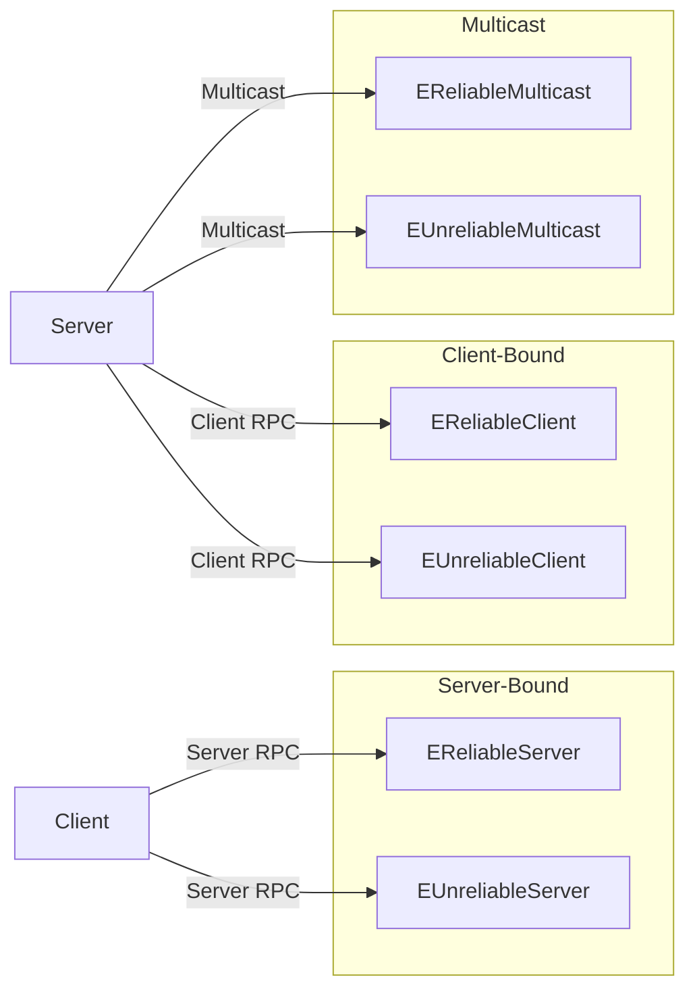
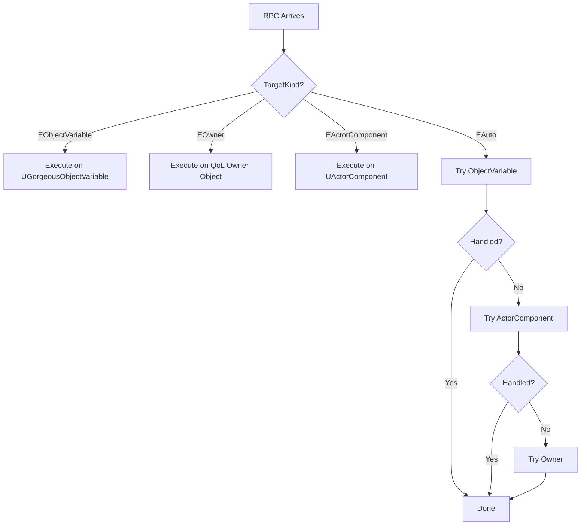
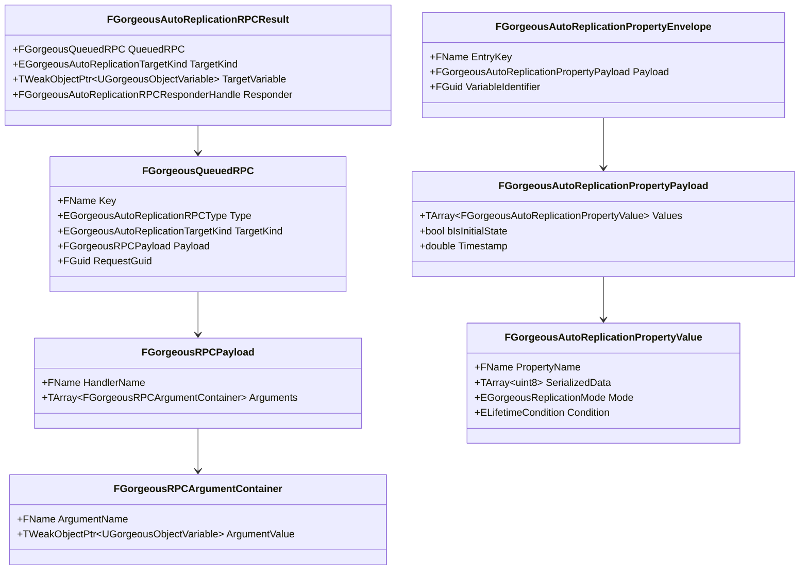

# 📦 AutoReplication Types

???+ info "Short Description"

    This page documents all the types, enums, and structs used by the AutoReplication system for property streaming, RPC payloads, and networking configuration.

??? info "Long Description"

    The AutoReplication system defines a rich set of types that control how properties are serialized, how RPCs are routed, and how streams are configured. These types are used throughout the Mixin, Relay, Transporter, and Coordinator components.

---

## 🎯 Enums

### EGorgeousAutoReplicationRPCType

Defines the RPC routing behavior and reliability.

| Value | Reliability | Direction | Use Case |
| :---- | :---------- | :-------- | :------- |
| `EReliableServer` | Guaranteed delivery | Client → Server | Critical game state changes |
| `EUnreliableServer` | Best effort | Client → Server | Frequent updates (input, position) |
| `EReliableClient` | Guaranteed delivery | Server → Client | Important notifications |
| `EUnreliableClient` | Best effort | Server → Client | Cosmetic updates |
| `EReliableMulticast` | Guaranteed delivery | Server → All Clients | Global events |
| `EUnreliableMulticast` | Best effort | Server → All Clients | Frequent state broadcasts |

---

### EGorgeousReplicationMode

Determines how property values are serialized for network transport.

| Value | Description |
| :---- | :---------- |
| `EProperty` | Standard FProperty serialization - safe default, works with all types |
| `ENetSerialize` | Network-optimized NetSerialize - more efficient for supported types |
| `ECustomPayload` | Custom payload via Blueprint/C++ override - full serialization control |

=== "EProperty Mode"

    Uses `FProperty::SerializeItem` for standard property serialization. This mode supports all property types but may be less bandwidth-efficient.

=== "ENetSerialize Mode"

    Uses `FProperty::NetSerializeItem` for network-optimized serialization. This mode leverages Unreal's built-in network serialization which handles object references via `PackageMap`.

=== "ECustomPayload Mode"

    Calls the `BuildCustomAutoReplicationPayload` Blueprint/C++ override on the owning Object Variable. This mode gives full control over serialization.

---

### EGorgeousAutoReplicationTargetKind

Specifies where an RPC should be executed.

| Value | Description |
| :---- | :---------- |
| `EObjectVariable` | Execute on the registered Object Variable |
| `EOwner` | Execute on the owning QoL object (GameState, PlayerController, etc.) |
| `EActorComponent` | Execute on an Actor Component attached to the owner |
| `EAuto` | Try ObjectVariable first, then ActorComponent, then Owner |

---

### EGorgeousRepNotifyPolicy

Controls when RepNotify functions are fired.

| Value | Description |
| :---- | :---------- |
| `OnChanged` | Fire notify only when value changes |
| `Always` | Fire notify on every replication |

---

## 📋 Structs

### FGorgeousAutoReplicationStreamConfig

Configuration for a property replication stream.

| Property | Type | Default | Description |
| :------- | :--- | :------ | :---------- |
| `bEnabled` | `bool` | `true` | Master switch for this stream |
| `bRespectAccessPolicy` | `bool` | `false` | Whether to check `ResolveRespectAccessPolicy()` before replicating |
| `bSendInitialState` | `bool` | `true` | Send full state on initial connection |
| `MinReplicationInterval` | `float` | `0.0f` | Throttle interval in seconds |
| `ReplicationPriority` | `float` | `0.5f` | Priority weight for bandwidth allocation (0.0-1.0) |

---

### FGorgeousAutoReplicationPropertyValue

A single serialized property value.

| Property | Type | Description |
| :------- | :--- | :---------- |
| `PropertyName` | `FName` | Name of the property |
| `SerializedData` | `TArray<uint8>` | Serialized bytes |
| `Mode` | `EGorgeousReplicationMode` | Replication mode used for serialization |
| `Condition` | `ELifetimeCondition` | Replication condition (COND_None, COND_OwnerOnly, etc.) |

---

### FGorgeousAutoReplicationPropertyPayload

A batch of property values for a single variable.

| Property | Type | Description |
| :------- | :--- | :---------- |
| `Values` | `TArray<FGorgeousAutoReplicationPropertyValue>` | All property values in this payload |
| `bIsInitialState` | `bool` | Whether this is an initial state sync |
| `Timestamp` | `double` | Timestamp for ordering |

---

### FGorgeousAutoReplicationPropertyEnvelope

Wraps a payload with routing information.

| Property | Type | Description |
| :------- | :--- | :---------- |
| `EntryKey` | `FName` | Key to resolve the target entry |
| `Payload` | `FGorgeousAutoReplicationPropertyPayload` | The payload containing property values |
| `VariableIdentifier` | `FGuid` | Variable identifier for validation |

---

### FGorgeousRPCPayload

RPC handler invocation data.

| Property | Type | Description |
| :------- | :--- | :---------- |
| `HandlerName` | `FName` | Name of the handler function to invoke |
| `Arguments` | `TArray<FGorgeousRPCArgumentContainer>` | Arguments to pass to the handler |

---

### FGorgeousRPCArgumentContainer

Container for a single RPC argument.

| Property | Type | Description |
| :------- | :--- | :---------- |
| `ArgumentName` | `FName` | Argument parameter name |
| `ArgumentValue` | `TWeakObjectPtr<UGorgeousObjectVariable>` | Object Variable holding the value |

---

### FGorgeousQueuedRPC

A complete RPC request ready for dispatch.

| Property | Type | Description |
| :------- | :--- | :---------- |
| `Key` | `FName` | Entry key for target resolution |
| `Type` | `EGorgeousAutoReplicationRPCType` | RPC type (reliability + direction) |
| `TargetKind` | `EGorgeousAutoReplicationTargetKind` | Target kind for execution |
| `Payload` | `FGorgeousRPCPayload` | Handler and arguments |
| `RequestGuid` | `FGuid` | Unique request identifier |

---

### FGorgeousAutoReplicationRPCResult

Result container returned after RPC execution.

| Property | Type | Description |
| :------- | :--- | :---------- |
| `QueuedRPC` | `FGorgeousQueuedRPC` | The original queued RPC |
| `TargetKind` | `EGorgeousAutoReplicationTargetKind` | Resolved target kind |
| `TargetVariable` | `TWeakObjectPtr<UGorgeousObjectVariable>` | Target variable (if applicable) |
| `TargetOwner` | `TWeakObjectPtr<UObject>` | Target owner object (if applicable) |
| `TargetVariableIdentifier` | `FGuid` | Variable identifier for result routing |
| `Responder` | `FGorgeousAutoReplicationRPCResponderHandle` | Responder handle for async callbacks |

---

### FGorgeousAutoReplicationRPCResponderHandle

Handle identifying the responder for async RPC results.

| Property | Type | Description |
| :------- | :--- | :---------- |
| `bIsServer` | `bool` | Whether this handle represents the server |
| `PlayerId` | `int32` | Controller player ID (if client) |
| `Controller` | `TWeakObjectPtr<APlayerController>` | Weak reference to the responding controller |

**Helper Methods:**

- `bool IsValid() const` - Check if handle is valid
- `static FGorgeousAutoReplicationRPCResponderHandle MakeServerHandle()` - Create server handle
- `static FGorgeousAutoReplicationRPCResponderHandle FromController(APlayerController*)` - Create client handle

---

### FGorgeousAutoReplicationConditionContext

Context passed to replication condition evaluation.

| Property | Type | Description |
| :------- | :--- | :---------- |
| `PropertyName` | `FName` | The property being evaluated |
| `Connection` | `TWeakObjectPtr<UNetConnection>` | The connection being evaluated |
| `TargetController` | `TWeakObjectPtr<APlayerController>` | The target player controller |
| `bIsInitialState` | `bool` | Whether this is initial state |

---

## 🔄 Type Relationships

---

## ⚠️ Important Notes

!!! info "Serialization Modes"
    
    Choose your serialization mode carefully:
    
    - **EProperty**: Safe default, works with all types
    - **ENetSerialize**: More efficient for types with NetSerialize support
    - **ECustomPayload**: Full control, but requires implementation

!!! warning "PackageMap Requirement"
    
    When using `ENetSerialize` mode, ensure a valid `UPackageMap` is available. Object references will fail to resolve without it.

!!! tip "RPC Argument Values"
    
    RPC arguments must be Object Variables with a `Value` property. The system copies the value from the argument's `Value` property to the handler's parameter.
