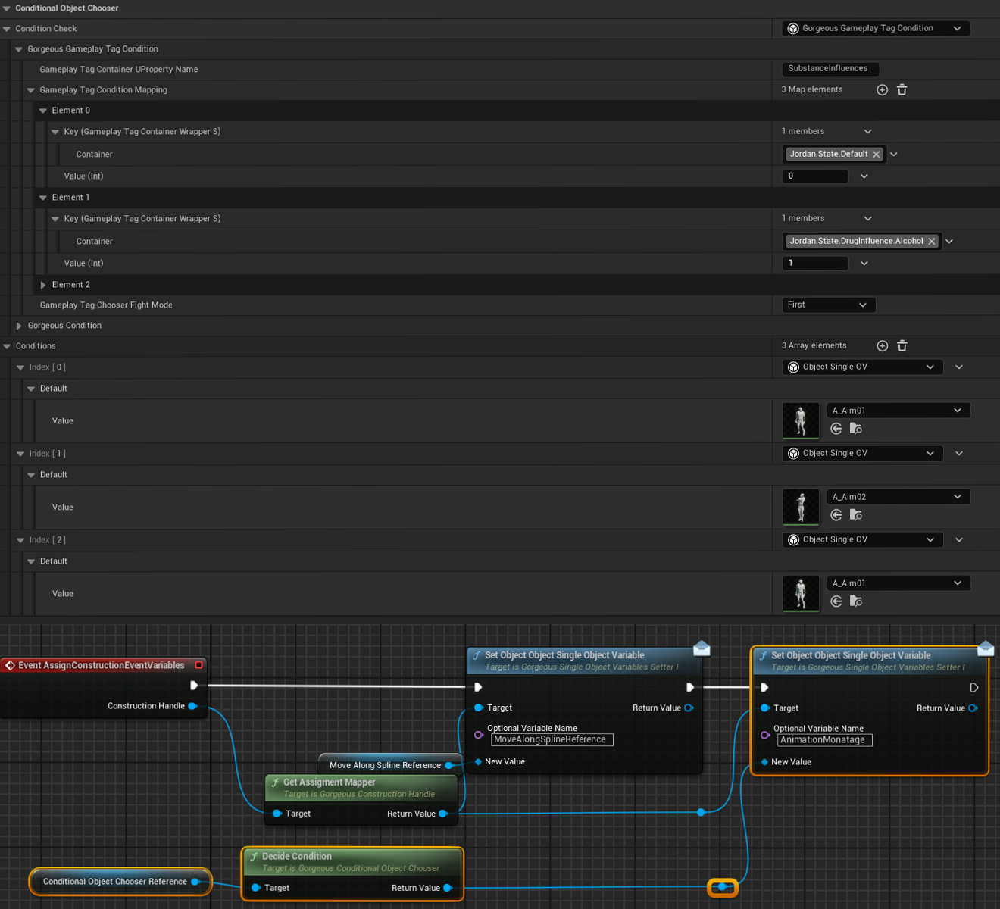

# ✨ Chooser (Blueprint & C++)

???+ info "Short Description"

    The `UGorgeousConditionalObjectChooser` class provides a mechanism to select an Object Variable based on specified conditions within the Gorgeous Things ecosystem.

??? info "Long Description"

    `UGorgeousConditionalObjectChooser` serves as a decision-making component that dynamically selects Object Variables based on condition evaluation. This class enables conditional branching in data flow and object selection, allowing for more complex and responsive systems within the Gorgeous Things framework.

##   🚀 Features

### `DecideCondition`
=== "📝 Function Details"

    <div class="function-description">

    Selects an object variable based on the condition check. This function evaluates the ConditionCheck and returns the appropriate Object Variable from the Conditions array.

    </div>

    === "Output"

        |   Parameter     |   Type                      |   Description                                   |
        | :-------------- | :-------------------------- | :---------------------------------------------- |
        |   `ReturnType`  |   `UGorgeousObjectVariable*` |   The selected Object Variable based on the condition evaluation. |
    
    ??? note "Important"

        Ensure that both the `ConditionCheck` and `Conditions` array are properly set up before calling this function. If the condition evaluation fails or no matching condition is found, the function might return null.

=== "📚 Usage Examples"

    === "Blueprint"

        <figure markdown="span">
        { width="100%" }
        <figcaption>Get the selected Object Variable based on condition evaluation.</figcaption>
        </figure>

    === "C++"

        ```cpp hl_lines="4"
        UGorgeousConditionalObjectChooser* ConditionalChooser = ...;

        // Get the selected object variable based on condition
        UGorgeousObjectVariable* SelectedVariable = ConditionalChooser->DecideCondition();
        ```
    
---

###   Variable Properties

|   Property             |   Type                                           |   Description                                                                     |
| :--------------------- | :----------------------------------------------- | :-------------------------------------------------------------------------------- |
|   `ConditionCheck`     |   `UGorgeousCondition*`                          |   The condition check object used to determine the selection.                     |
|   `Conditions`         |   `TArray<UGorgeousObjectVariable*>`             |   The array of object variables to choose from based on the condition.            |

<style>
.function-description {
    margin-top: 0.5em;
    font-style: italic;
    color: #555;
}
</style>