# 🔬 Object Variables Deep Dive

???+ info "Overview"

    This document provides an in-depth technical exploration of the Object Variable and Root Object Variable system's architecture, lifecycle management, and internal mechanisms. It focuses on the core variable system itself - for networking details, see the [AutoReplication Deep Dive](../AutoReplication/GT-C-AutoReplication-DeepDive.md).

---

## 🏗️ Architectural Foundation

The Object Variable system is built on a hierarchical registry pattern with support for persistence and cross-reference resolution.

```mermaid
graph TB
    subgraph "Core Architecture"
        ROOT[Root Object Variable]
        REG[Variable Registry]
        ID[Identifier System]
        SERIAL[Serialization]
    end
    
    subgraph "Support Systems"
        PERSIST[Persistence]
        SNAPSHOT[Snapshot System]
        HIERARCHY[Parent-Child Relations]
    end
    
    ROOT --> REG
    REG --> ID
    ID --> SERIAL
    
    SERIAL --> PERSIST
    SERIAL --> SNAPSHOT
    ROOT --> HIERARCHY
    
    style ROOT fill:#4a5568
    style REG fill:#2d3748
```

---

## 🌳 Hierarchy Model

### Root Object Variable Pattern

All Object Variables exist within a hierarchy rooted at `UGorgeousRootObjectVariable` instances. The Root acts as a namespace and registry manager.

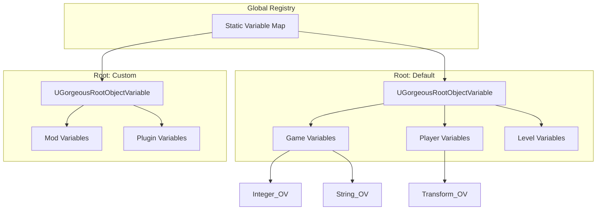

### Parent-Child Relationships

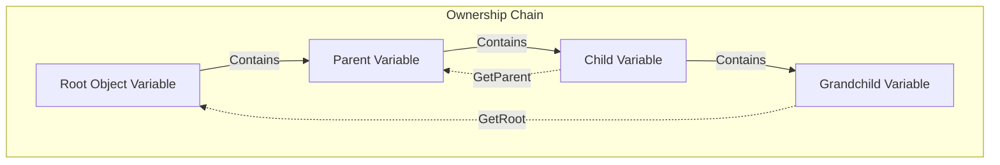

### Registry Resolution Algorithm

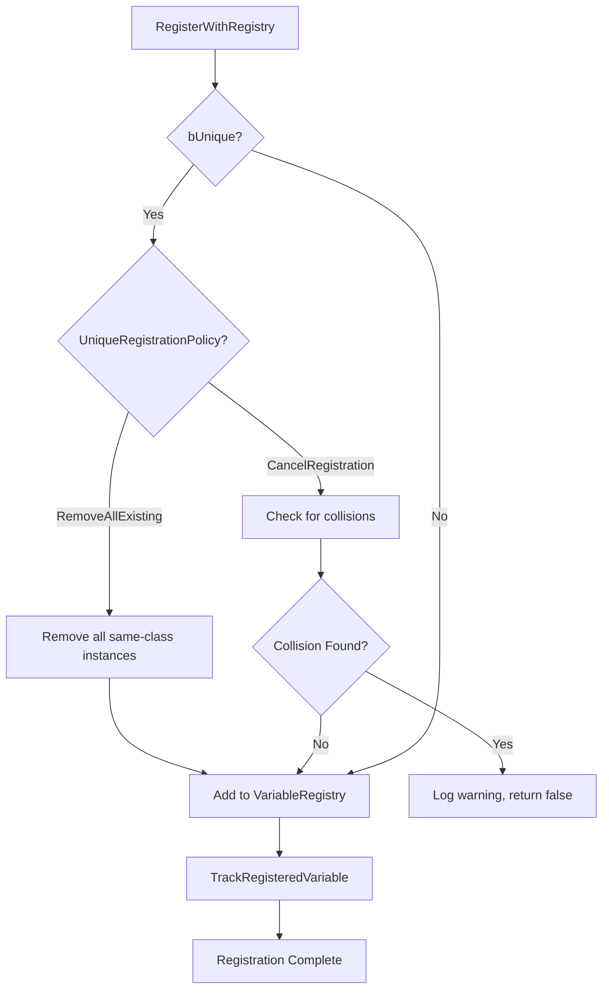

---

## 🆔 Identifier System

### GUID Generation & Resolution

Every Object Variable has a unique identifier (`FGuid`) for cross-reference and lookup:

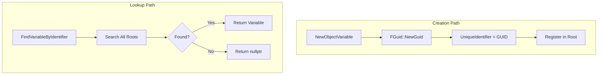

### Display Name Management

Display names provide human-readable identification with automatic uniqueness handling:

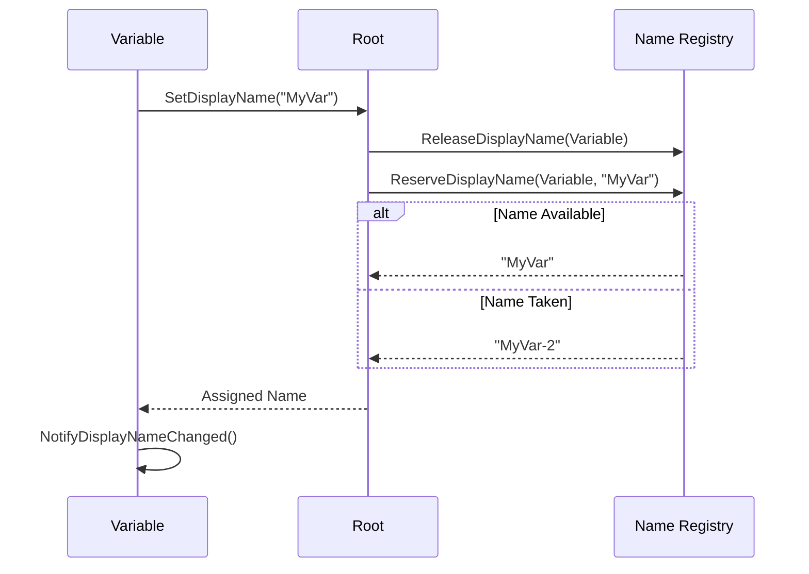

### Name Uniqueness Algorithm

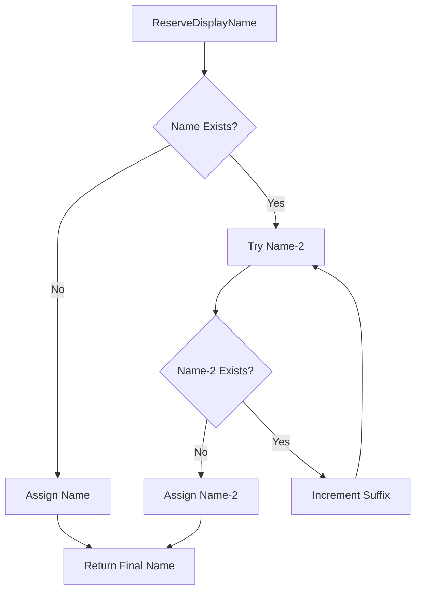

---

## 🔄 Lifecycle Management

### Creation Flow

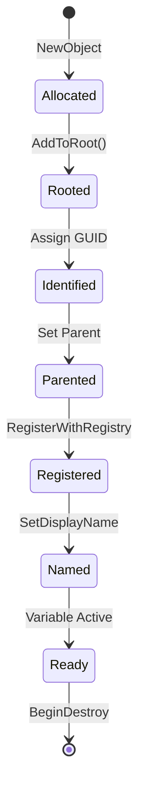

### Detailed Creation Sequence

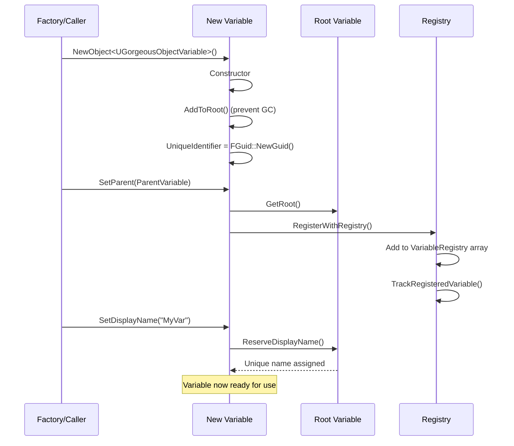

### Destruction Sequence

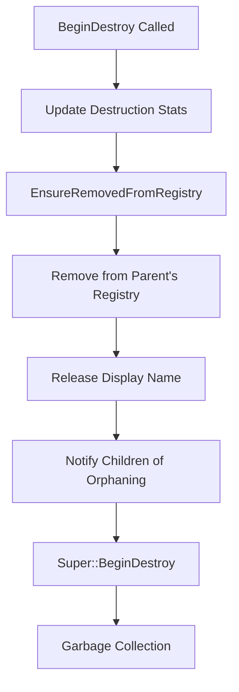

### Stats Tracking

The system maintains runtime statistics for debugging:

| Stat | Description |
|:-----|:------------|
| `STAT_GOV_Created` | Total variables created this session |
| `STAT_GOV_Destroyed` | Total variables destroyed this session |
| `STAT_GOV_Alive` | Currently alive count (Created - Destroyed) |

---

## 📦 Serialization System

### Snapshot Capture

Snapshots capture the complete state of a variable for persistence or duplication:

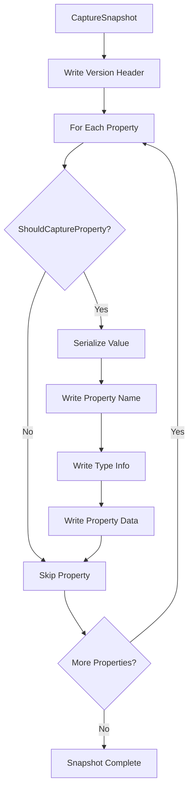

### Property Filter Criteria

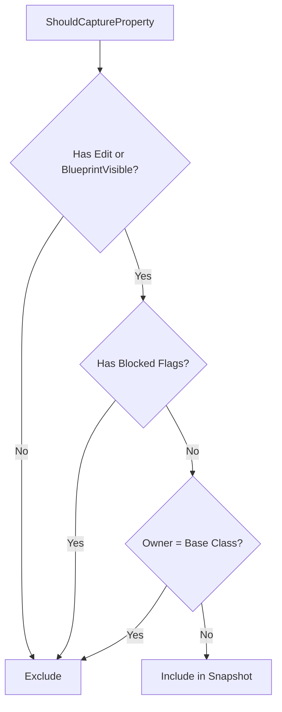

**Blocked Property Flags:**

| Flag | Reason for Exclusion |
|:-----|:---------------------|
| `CPF_Transient` | Temporary runtime data |
| `CPF_DuplicateTransient` | Not meant to be copied |
| `CPF_TextExportTransient` | Export-only data |
| `CPF_NonPIEDuplicateTransient` | PIE-specific exclusion |
| `CPF_DisableEditOnInstance` | Instance-locked |
| `CPF_EditConst` | Read-only property |

### Snapshot Restoration

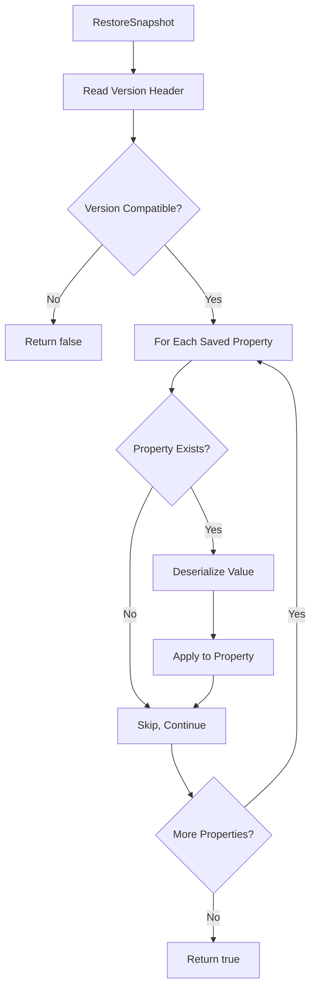

---

## 📊 Memory Layout

### Object Variable Instance Structure

```
UGorgeousObjectVariable Memory Layout (Approximate)
├── UObject Header (~56 bytes)
│   ├── VTable pointer
│   ├── Object flags
│   ├── Index & serial number
│   └── Class pointer
├── Configuration
│   ├── bPersistent (1 byte)
│   ├── bUnique (1 byte)
│   ├── UniqueRegistrationPolicy (1 byte)
│   └── Padding (5 bytes)
├── Identifiers
│   ├── UniqueIdentifier (16 bytes - FGuid)
│   │   ├── A (4 bytes)
│   │   ├── B (4 bytes)
│   │   ├── C (4 bytes)
│   │   └── D (4 bytes)
│   └── DisplayName (~24 bytes - FString header)
├── Hierarchy
│   ├── Parent (8 bytes - TObjectPtr)
│   └── VariableRegistry (~24 bytes - TArray header)
│       ├── Data pointer (8 bytes)
│       ├── ArrayNum (4 bytes)
│       └── ArrayMax (4 bytes)
└── Subclass-specific data (varies by type)
```

### Root Object Variable Additional Data

```
UGorgeousRootObjectVariable Additional Memory
├── Base UGorgeousObjectVariable
├── RootName (8 bytes - FName)
├── DisplayNameRegistry (~48 bytes - TMap header)
├── IdentifierLookup (~48 bytes - TMap header)
└── Static Registration (~8 bytes)
```

---

## 🔍 Lookup Operations

### Find Variable by Identifier

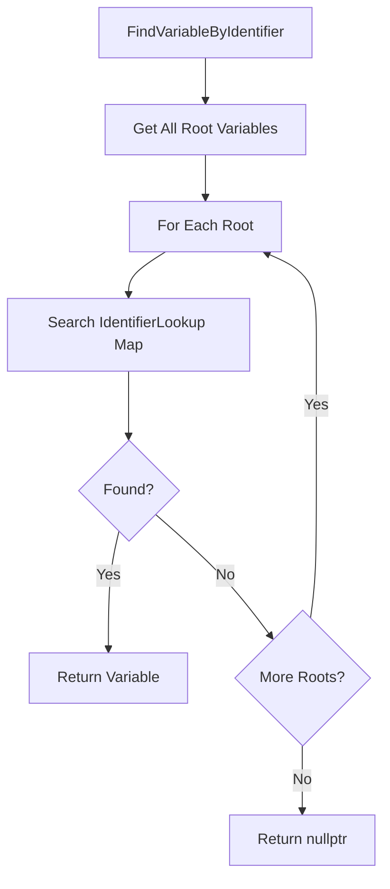

### Find Variable by Display Name

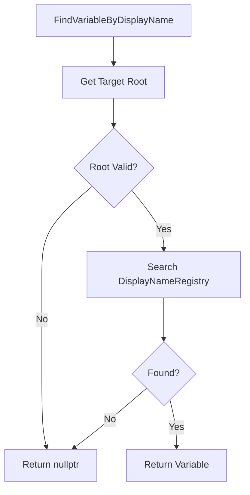

---

## 🧪 Debugging Tools

### Diagnostic Queries

```cpp
// Check if variable is properly registered
bool bRegistered = UGorgeousRootObjectVariable::IsVariableRegistered(Variable);

// Find variable by identifier
UGorgeousObjectVariable* Found = 
    UGorgeousRootObjectVariable::FindVariableByIdentifier(GUID);

// Get hierarchy registry for a root
TArray<UGorgeousObjectVariable*> Registry = 
    UGorgeousRootObjectVariable::GetVariableHierarchyRegistry(RootName);

// Get all variables of a specific type
TArray<UGorgeousObjectVariable*> TypedVars = 
    Root->GetAllVariablesOfClass(UMyCustomVariable::StaticClass());
```

### Registration Validation

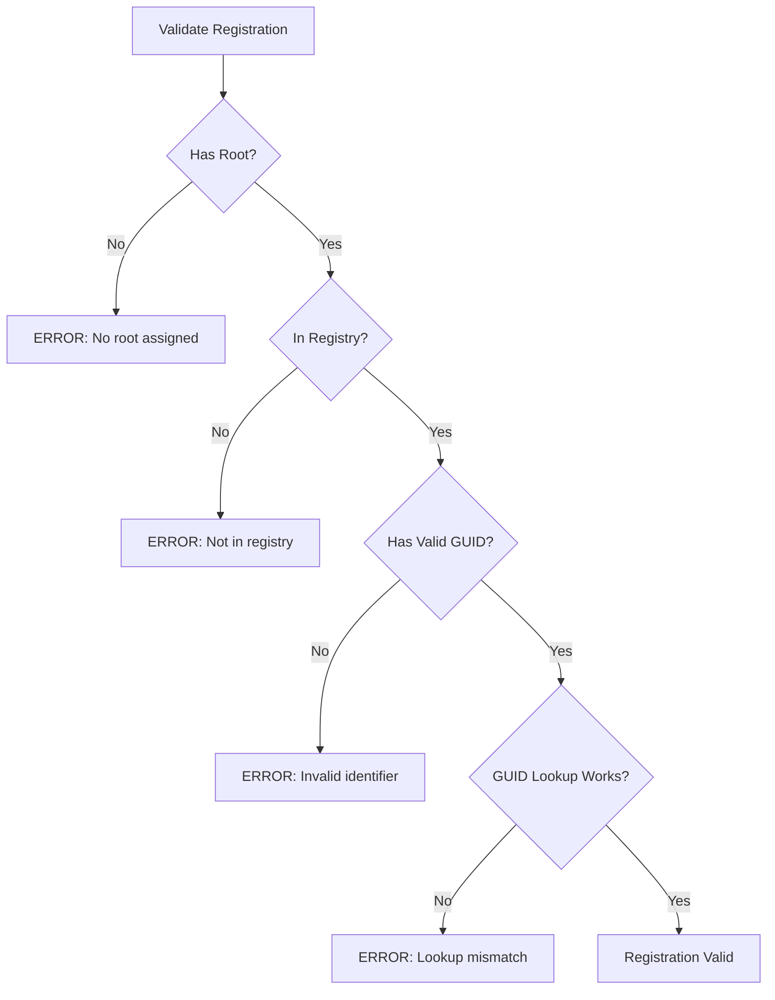

---

## ⚠️ Known Limitations

!!! danger "Critical Constraints"
    
    1. **No circular parent references**: Parent chain must be acyclic
    2. **Single root per variable**: Variables cannot belong to multiple roots simultaneously
    3. **GUID stability**: Changing GUID requires manual re-registration
    4. **Display name uniqueness**: Names are unique per-root only

!!! info "Design Tradeoffs"
    
    - **Hierarchical registry** over flat lookup for logical organization
    - **String-based display names** for human readability vs raw GUIDs
    - **GUID-based identifiers** for stable cross-session references
    - **Lazy lookup maps** built on first access for memory efficiency
