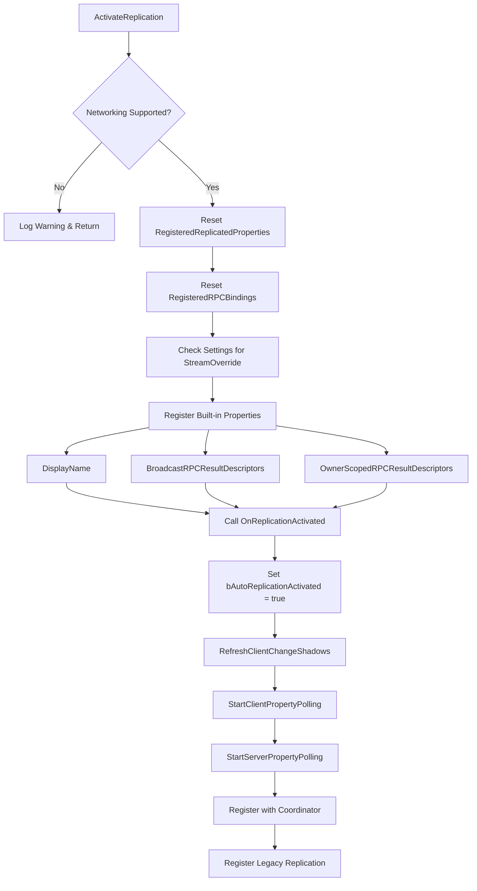
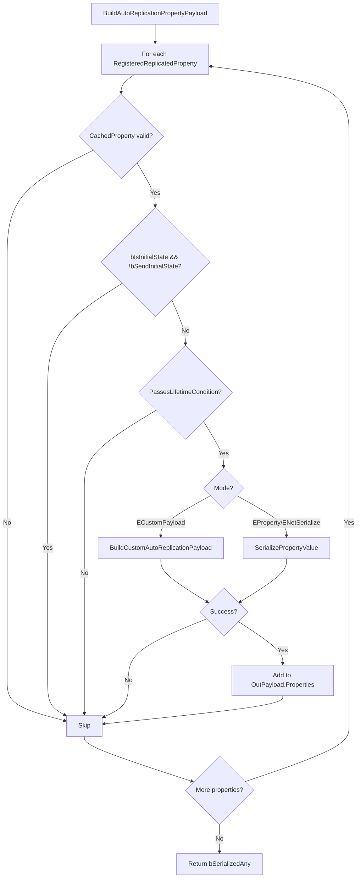
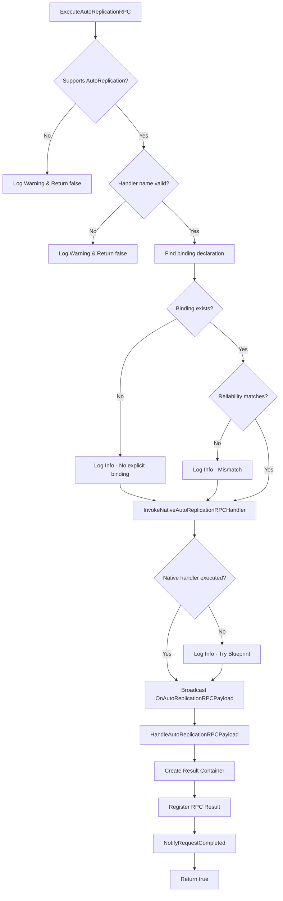

# 📦 UGorgeousObjectVariable — Replication Functions

???+ info "Short Description"

    This page documents the AutoReplication-related functions exposed by `UGorgeousObjectVariable`, including property registration, RPC handling, and payload serialization.

??? info "Long Description"

    `UGorgeousObjectVariable` is the base class for all Object Variables in Gorgeous Core. It provides comprehensive networking support through the AutoReplication system, including property streaming, RPC handling, and custom payload serialization.

---

## 🔄 Replication Activation

### ActivateReplication

Activates AutoReplication for this variable. Called automatically when the variable is registered with a mixin.

=== "📝 Function Details"

    | Property | Value |
    | :------- | :---- |
    | **Category** | `Gorgeous Core\|Object Variables\|Networking` |
    | **Access** | `Public` |
    | **Callable From** | `C++` |

    **Inputs**

    | Name | Type | Description |
    | :--- | :--- | :---------- |
    | `Context` | `const FGorgeousAutoReplicationContext&` | Activation context with owner, key, and index |

    **Outputs**

    | Name | Type | Description |
    | :--- | :--- | :---------- |
    | *(None)* | `void` | — |

=== "📚 Usage Examples"

    ```cpp title="C++ Example"
    // Usually called internally by the mixin
    FGorgeousAutoReplicationContext Context;
    Context.OwningObject = GameState;
    Context.EntryKey = TEXT("PlayerInventory");
    Context.ReplicationIndex = 0;
    
    ObjectVariable->ActivateReplication(Context);
    ```



---

### OnReplicationActivated

Blueprint/C++ event called when replication is activated. Override to register custom properties and RPC handlers.

=== "📝 Function Details"

    | Property | Value |
    | :------- | :---- |
    | **Category** | `Gorgeous Core\|Object Variables\|Networking` |
    | **Access** | `Protected` |
    | **Callable From** | `Blueprint`, `C++` |
    | **Overridable** | `Yes` (BlueprintNativeEvent) |

    **Inputs**

    | Name | Type | Description |
    | :--- | :--- | :---------- |
    | `Context` | `const FGorgeousAutoReplicationContext&` | Activation context |

    **Outputs**

    | Name | Type | Description |
    | :--- | :--- | :---------- |
    | *(None)* | `void` | — |

=== "📚 Usage Examples"

    === "Blueprint"
        
        
        
    === "C++"
        
        ```cpp title="C++ Example"
        void UMyObjectVariable::OnReplicationActivated_Implementation(
            const FGorgeousAutoReplicationContext& Context)
        {
            Super::OnReplicationActivated_Implementation(Context);
            
            // Register custom replicated properties
            RegisterReplicatedProperty(
                GET_MEMBER_NAME_CHECKED(UMyObjectVariable, CustomData),
                EGorgeousReplicationMode::ENetSerialize,
                true // bSendInitialState
            );
            
            // Register RPC handler
            BindRPCHandler(TEXT("OnCustomAction"), 
                           EGorgeousAutoReplicationRPCType::EReliableServer);
        }
        ```

---

## 📋 Property Registration

### RegisterReplicatedProperty

Registers a property for AutoReplication.

=== "📝 Function Details"

    | Property | Value |
    | :------- | :---- |
    | **Category** | `Gorgeous Core\|Object Variables\|Networking` |
    | **Access** | `Protected` |
    | **Callable From** | `C++` |

    **Inputs**

    | Name | Type | Description |
    | :--- | :--- | :---------- |
    | `PropertyName` | `FName` | Name of the property to register |
    | `Mode` | `EGorgeousReplicationMode` | Serialization mode |
    | `bSendInitialState` | `bool` | Whether to send on initial connection |
    | `AdvancedConfig` | `const FGorgeousReplicatedPropertyConfig&` | Advanced configuration (RepNotify, condition) |

    **Outputs**

    | Name | Type | Description |
    | :--- | :--- | :---------- |
    | *(None)* | `void` | — |

=== "📚 Usage Examples"

    ```cpp title="C++ Example"
    // Basic registration
    RegisterReplicatedProperty(
        TEXT("Score"),
        EGorgeousReplicationMode::EProperty,
        true
    );
    
    // With RepNotify
    FGorgeousReplicatedPropertyConfig Config;
    Config.RepNotifyFunction = GET_FUNCTION_NAME_CHECKED(UMyVar, OnRep_Health);
    Config.RepNotifyPolicy = EGorgeousRepNotifyPolicy::OnChanged;
    Config.bFireInitialNotify = true;
    
    RegisterReplicatedProperty(
        TEXT("Health"),
        EGorgeousReplicationMode::ENetSerialize,
        true,
        Config
    );
    
    // Owner-only replication
    FGorgeousReplicatedPropertyConfig OwnerConfig;
    OwnerConfig.ReplicationCondition = COND_OwnerOnly;
    
    RegisterReplicatedProperty(
        TEXT("PrivateData"),
        EGorgeousReplicationMode::EProperty,
        true,
        OwnerConfig
    );
    ```

!!! tip "RepNotify Shadow State"
    
    When a RepNotify function is specified, the system automatically initializes a shadow copy of the property to detect changes.

---

### FGorgeousReplicatedPropertyConfig

Advanced configuration for replicated properties.

```cpp
USTRUCT(BlueprintType)
struct FGorgeousReplicatedPropertyConfig
{
    GENERATED_BODY()

    /** Replication condition (COND_None, COND_OwnerOnly, etc.) */
    UPROPERTY(EditAnywhere, BlueprintReadWrite)
    ELifetimeCondition ReplicationCondition = COND_None;
    
    /** Function to call when value changes */
    UPROPERTY(EditAnywhere, BlueprintReadWrite)
    FName RepNotifyFunction = NAME_None;
    
    /** When to fire RepNotify */
    UPROPERTY(EditAnywhere, BlueprintReadWrite)
    EGorgeousRepNotifyPolicy RepNotifyPolicy = EGorgeousRepNotifyPolicy::OnChanged;
    
    /** Whether to fire RepNotify on initial replication */
    UPROPERTY(EditAnywhere, BlueprintReadWrite)
    bool bFireInitialNotify = true;
};
```

| Property | Description |
| :------- | :---------- |
| `ReplicationCondition` | Standard Unreal replication condition (COND_None, COND_OwnerOnly, COND_SkipOwner, etc.) |
| `RepNotifyFunction` | Name of the function to call when the property changes |
| `RepNotifyPolicy` | `OnChanged` fires only when value differs, `Always` fires on every replication |
| `bFireInitialNotify` | Whether to fire RepNotify on the first replication |

---

## 📤 Payload Serialization

### BuildAutoReplicationPropertyPayload

Builds a serialized payload containing all dirty registered properties.

=== "📝 Function Details"

    | Property | Value |
    | :------- | :---- |
    | **Category** | `Gorgeous Core\|Object Variables\|Networking` |
    | **Access** | `Public` |
    | **Callable From** | `C++` |

    **Inputs**

    | Name | Type | Description |
    | :--- | :--- | :---------- |
    | `ConditionContext` | `const FGorgeousAutoReplicationConditionContext&` | Context for condition evaluation |
    | `OutPayload` | `FGorgeousAutoReplicationPropertyPayload&` | Output payload |

    **Outputs**

    | Name | Type | Description |
    | :--- | :--- | :---------- |
    | `Return` | `bool` | `true` if any properties were serialized |

=== "📚 Usage Examples"

    ```cpp title="C++ Example"
    FGorgeousAutoReplicationConditionContext Context;
    Context.bIsInitialState = true;
    Context.PackageMap = Connection->PackageMap;
    
    FGorgeousAutoReplicationPropertyPayload Payload;
    if (Variable->BuildAutoReplicationPropertyPayload(Context, Payload))
    {
        // Send payload through relay/transporter
    }
    ```



---

### ApplyAutoReplicationPropertyPayload

Applies a received payload to update local property values.

=== "📝 Function Details"

    | Property | Value |
    | :------- | :---- |
    | **Category** | `Gorgeous Core\|Object Variables\|Networking` |
    | **Access** | `Public` |
    | **Callable From** | `C++` |

    **Inputs**

    | Name | Type | Description |
    | :--- | :--- | :---------- |
    | `Payload` | `const FGorgeousAutoReplicationPropertyPayload&` | Payload to apply |
    | `PackageMap` | `UPackageMap*` | Package map for object resolution |

    **Outputs**

    | Name | Type | Description |
    | :--- | :--- | :---------- |
    | `Return` | `bool` | `true` if any properties were applied |

=== "📚 Usage Examples"

    ```cpp title="C++ Example"
    // Called internally by HandleTransportedPropertyPayload
    if (Variable->ApplyAutoReplicationPropertyPayload(Payload, PackageMap))
    {
        // Properties were updated, fire RepNotifies
        Variable->FirePendingRepNotifies();
    }
    ```

---

### BuildCustomAutoReplicationPayload

Override to provide custom serialization for a property.

=== "📝 Function Details"

    | Property | Value |
    | :------- | :---- |
    | **Category** | `Gorgeous Core\|Object Variables\|Networking` |
    | **Access** | `Protected` |
    | **Callable From** | `Blueprint`, `C++` |
    | **Overridable** | `Yes` (BlueprintNativeEvent) |

    **Inputs**

    | Name | Type | Description |
    | :--- | :--- | :---------- |
    | `PropertyName` | `FName` | Property being serialized |
    | `OutPayload` | `TArray<uint8>&` | Output byte array |
    | `bIsInitialState` | `bool` | Whether this is initial state sync |

    **Outputs**

    | Name | Type | Description |
    | :--- | :--- | :---------- |
    | `Return` | `bool` | `true` if payload was built |

=== "📚 Usage Examples"

    ```cpp title="C++ Example"
    bool UMyObjectVariable::BuildCustomAutoReplicationPayload_Implementation(
        FName PropertyName,
        TArray<uint8>& OutPayload,
        bool bIsInitialState)
    {
        if (PropertyName == TEXT("CompressedData"))
        {
            // Custom compression
            FMemoryWriter Writer(OutPayload);
            // ... write compressed data ...
            return true;
        }
        
        return Super::BuildCustomAutoReplicationPayload_Implementation(
            PropertyName, OutPayload, bIsInitialState);
    }
    ```

---

### ApplyCustomAutoReplicationPayload

Override to provide custom deserialization for a property.

=== "📝 Function Details"

    | Property | Value |
    | :------- | :---- |
    | **Category** | `Gorgeous Core\|Object Variables\|Networking` |
    | **Access** | `Protected` |
    | **Callable From** | `Blueprint`, `C++` |
    | **Overridable** | `Yes` (BlueprintNativeEvent) |

    **Inputs**

    | Name | Type | Description |
    | :--- | :--- | :---------- |
    | `PropertyName` | `FName` | Property being deserialized |
    | `Payload` | `const TArray<uint8>&` | Input byte array |
    | `bIsInitialState` | `bool` | Whether this is initial state sync |

    **Outputs**

    | Name | Type | Description |
    | :--- | :--- | :---------- |
    | `Return` | `bool` | `true` if payload was applied |

---

## 📡 RPC Handling

### BindRPCHandler

Registers an RPC handler function.

=== "📝 Function Details"

    | Property | Value |
    | :------- | :---- |
    | **Category** | `Gorgeous Core\|Object Variables\|Networking` |
    | **Access** | `Protected` |
    | **Callable From** | `C++` |

    **Inputs**

    | Name | Type | Description |
    | :--- | :--- | :---------- |
    | `RPCName` | `FName` | Name of the RPC handler function |
    | `Reliability` | `EGorgeousAutoReplicationRPCType` | Expected RPC type |

    **Outputs**

    | Name | Type | Description |
    | :--- | :--- | :---------- |
    | *(None)* | `void` | — |

=== "📚 Usage Examples"

    ```cpp title="C++ Example"
    void UMyObjectVariable::OnReplicationActivated_Implementation(
        const FGorgeousAutoReplicationContext& Context)
    {
        Super::OnReplicationActivated_Implementation(Context);
        
        // Register server-bound RPC
        BindRPCHandler(TEXT("ServerTakeDamage"), 
                       EGorgeousAutoReplicationRPCType::EReliableServer);
        
        // Register multicast RPC
        BindRPCHandler(TEXT("MulticastPlayEffect"),
                       EGorgeousAutoReplicationRPCType::EReliableMulticast);
    }
    
    UFUNCTION()
    void ServerTakeDamage(int32 Damage, AActor* Instigator)
    {
        // Handle damage on server
    }
    ```

---

### RequestAutoReplicationRPC

Sends an AutoReplication RPC from this variable.

=== "📝 Function Details"

    | Property | Value |
    | :------- | :---- |
    | **Category** | `Gorgeous Core\|Object Variables\|Networking` |
    | **Access** | `Public` |
    | **Callable From** | `Blueprint`, `C++` |

    **Inputs**

    | Name | Type | Description |
    | :--- | :--- | :---------- |
    | `Type` | `EGorgeousAutoReplicationRPCType` | RPC type |
    | `Payload` | `const FGorgeousRPCPayload&` | Handler name and arguments |
    | `OverrideKey` | `FName` | Optional key override |
    | `OverrideContext` | `UObject*` | Optional context override |
    | `TargetKind` | `EGorgeousAutoReplicationTargetKind` | Target kind |

    **Outputs**

    | Name | Type | Description |
    | :--- | :--- | :---------- |
    | `Return` | `bool` | `true` if RPC was dispatched |

=== "📚 Usage Examples"

    === "Blueprint"
        
        

    === "C++"
        
        ```cpp title="C++ Example"
        // Build payload
        FGorgeousRPCPayload Payload;
        Payload.HandlerName = TEXT("ServerTakeDamage");
        Payload.Arguments.Add(FGorgeousRPCArgumentContainer(
            TEXT("Damage"), DamageVariable));
        Payload.Arguments.Add(FGorgeousRPCArgumentContainer(
            TEXT("Instigator"), InstigatorVariable));
        
        // Send to server
        RequestAutoReplicationRPC(
            EGorgeousAutoReplicationRPCType::EReliableServer,
            Payload,
            NAME_None,  // Use default key
            nullptr,    // Use default context
            EGorgeousAutoReplicationTargetKind::EObjectVariable
        );
        ```

---

### RequestAutoReplicationRPCAsync

Sends an AutoReplication RPC and returns an async action for result tracking.

=== "📝 Function Details"

    | Property | Value |
    | :------- | :---- |
    | **Category** | `Gorgeous Core\|Object Variables\|Networking` |
    | **Access** | `Public` |
    | **Callable From** | `Blueprint`, `C++` |

    **Inputs**

    | Name | Type | Description |
    | :--- | :--- | :---------- |
    | `Type` | `EGorgeousAutoReplicationRPCType` | RPC type |
    | `Payload` | `const FGorgeousRPCPayload&` | Handler name and arguments |
    | `OverrideKey` | `FName` | Optional key override |
    | `OverrideContext` | `UObject*` | Optional context override |
    | `TargetKind` | `EGorgeousAutoReplicationTargetKind` | Target kind |

    **Outputs**

    | Name | Type | Description |
    | :--- | :--- | :---------- |
    | `Return` | `UGorgeousAutoReplicationRPCRequestAsyncAction*` | Async action for result tracking |

=== "📚 Usage Examples"

    === "Blueprint"
        
        

    === "C++"
        
        ```cpp title="C++ Example"
        UGorgeousAutoReplicationRPCRequestAsyncAction* Action = 
            RequestAutoReplicationRPCAsync(
                EGorgeousAutoReplicationRPCType::EReliableServer,
                Payload,
                NAME_None,
                nullptr,
                EGorgeousAutoReplicationTargetKind::EObjectVariable
            );
        
        if (Action)
        {
            Action->OnCompleted.AddDynamic(this, &UMyClass::OnRPCCompleted);
            Action->Activate();
        }
        ```

---

### ExecuteAutoReplicationRPC

Executes an incoming RPC on this variable.

=== "📝 Function Details"

    | Property | Value |
    | :------- | :---- |
    | **Category** | `Gorgeous Core\|Object Variables\|Networking` |
    | **Access** | `Public` |
    | **Callable From** | `C++` |

    **Inputs**

    | Name | Type | Description |
    | :--- | :--- | :---------- |
    | `QueuedRPC` | `const FGorgeousQueuedRPC&` | The RPC to execute |
    | `OutReturnVariable` | `UGorgeousObjectVariable**` | Optional output for result container |

    **Outputs**

    | Name | Type | Description |
    | :--- | :--- | :---------- |
    | `Return` | `bool` | `true` if RPC was handled |



---

### InvokeNativeAutoReplicationRPCHandler

Invokes a native C++ function as an RPC handler.

=== "📝 Function Details"

    | Property | Value |
    | :------- | :---- |
    | **Category** | `Gorgeous Core\|Object Variables\|Networking` |
    | **Access** | `Protected` |
    | **Callable From** | `C++` |
    | **Overridable** | `Yes` |

    **Inputs**

    | Name | Type | Description |
    | :--- | :--- | :---------- |
    | `QueuedRPC` | `const FGorgeousQueuedRPC&` | The RPC to execute |
    | `OutReturnVariable` | `UGorgeousObjectVariable**` | Optional output for return value |

    **Outputs**

    | Name | Type | Description |
    | :--- | :--- | :---------- |
    | `Return` | `bool` | `true` if a native handler was found and executed |

---

### HandleAutoReplicationRPCPayload

Blueprint event fired when an RPC is received.

=== "📝 Function Details"

    | Property | Value |
    | :------- | :---- |
    | **Category** | `Gorgeous Core\|Object Variables\|Networking` |
    | **Access** | `Protected` |
    | **Callable From** | `Blueprint` |
    | **Overridable** | `Yes` (BlueprintImplementableEvent) |

    **Inputs**

    | Name | Type | Description |
    | :--- | :--- | :---------- |
    | `QueuedRPC` | `const FGorgeousQueuedRPC&` | The received RPC |

    **Outputs**

    | Name | Type | Description |
    | :--- | :--- | :---------- |
    | *(None)* | `void` | — |

=== "📚 Usage Examples"

    === "Blueprint"
        
        

---

## ⚙️ Configuration

### SetAutoReplicationRespectAccessPolicy

Enables or disables access policy checking for this variable's stream.

=== "📝 Function Details"

    | Property | Value |
    | :------- | :---- |
    | **Category** | `Gorgeous Core\|Object Variables\|Networking` |
    | **Access** | `Public` |
    | **Callable From** | `Blueprint`, `C++` |

    **Inputs**

    | Name | Type | Description |
    | :--- | :--- | :---------- |
    | `bEnable` | `bool` | Whether to respect access policy |

    **Outputs**

    | Name | Type | Description |
    | :--- | :--- | :---------- |
    | *(None)* | `void` | — |

---

### SetNetworkAccessPolicy

Sets the access policy for this variable.

=== "📝 Function Details"

    | Property | Value |
    | :------- | :---- |
    | **Category** | `Gorgeous Core\|Object Variables\|Networking` |
    | **Access** | `Public` |
    | **Callable From** | `Blueprint`, `C++` |

    **Inputs**

    | Name | Type | Description |
    | :--- | :--- | :---------- |
    | `NewPolicy` | `EGorgeousObjectVariableAccessPolicy` | The new access policy |
    | `bApplyToSharedStack` | `bool` | Whether to apply to shared network stack |

    **Outputs**

    | Name | Type | Description |
    | :--- | :--- | :---------- |
    | *(None)* | `void` | — |

---

## 🔐 Access Policy

### EGorgeousObjectVariableAccessPolicy

```cpp
UENUM(BlueprintType)
enum class EGorgeousObjectVariableAccessPolicy : uint8
{
    /** Anyone can access this variable */
    Everyone        UMETA(DisplayName = "Everyone"),
    
    /** Only the owning player can access */
    OwnerOnly       UMETA(DisplayName = "Owner Only"),
    
    /** Players in the same team can access */
    TeamOnly        UMETA(DisplayName = "Team Only"),
    
    /** Custom access determined by CanControllerAccessVariable */
    Custom          UMETA(DisplayName = "Custom")
};
```

### CanControllerAccessVariable

Override to implement custom access policy logic.

=== "📝 Function Details"

    | Property | Value |
    | :------- | :---- |
    | **Category** | `Gorgeous Core\|Object Variables\|Networking` |
    | **Access** | `Protected` |
    | **Callable From** | `Blueprint`, `C++` |
    | **Overridable** | `Yes` (BlueprintNativeEvent) |

    **Inputs**

    | Name | Type | Description |
    | :--- | :--- | :---------- |
    | `Controller` | `AGorgeousPlayerController*` | The controller requesting access |

    **Outputs**

    | Name | Type | Description |
    | :--- | :--- | :---------- |
    | `Return` | `bool` | `true` if access is allowed |

=== "📚 Usage Examples"

    ```cpp title="C++ Example"
    bool UMyObjectVariable::CanControllerAccessVariable_Implementation(
        AGorgeousPlayerController* Controller) const
    {
        // Custom logic: Only allow players in the same guild
        if (Controller && OwningGuildID != INDEX_NONE)
        {
            return Controller->GetGuildID() == OwningGuildID;
        }
        
        return Super::CanControllerAccessVariable_Implementation(Controller);
    }
    ```

---

## ⚠️ Important Notes

!!! warning "Activation Order"
    
    Always call `Super::OnReplicationActivated_Implementation()` **before** registering custom properties and RPC handlers.

!!! tip "RepNotify Function Signature"
    
    RepNotify functions must be `UFUNCTION()` marked and can optionally take a single parameter of the previous value type:
    
    ```cpp
    UFUNCTION()
    void OnRep_Health();
    
    // Or with previous value:
    UFUNCTION()
    void OnRep_Health(int32 PreviousHealth);
    ```

!!! info "Custom Payload Mode"
    
    When using `EGorgeousReplicationMode::ECustomPayload`, you must implement both `BuildCustomAutoReplicationPayload` and `ApplyCustomAutoReplicationPayload` for the property to replicate.
