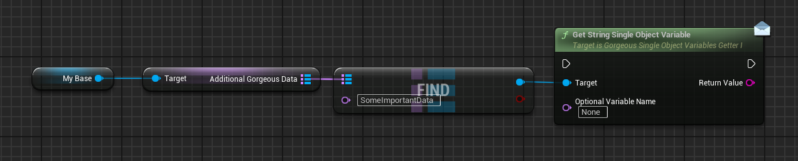

# ✨ Gorgeous World Settings (Blueprint & C++)

???+ info "Short Description"

    The `AGorgeousWorldSettings` class extends the standard Unreal Engine `AWorldSettings` by adding an object variable system, allowing you to store and manage world settings-specific data during gameplay.

??? info "Long Description"

    `AGorgeousWorldSettings` enhances the standard Unreal Engine `AWorldSettings` by integrating with the Gorgeous Things object variable system. It provides a structured way to store and access world settings-specific data through the `AdditionalGorgeousData` property, which is a map of named object variables. This allows you to maintain world settings, level configurations, and other important information that needs to be accessible throughout your game.

## 🚀 Features

### `AdditionalGorgeousData`
=== "📝 Function Details"

    <div class="function-description">

    A map of object variables that extends the standard world settings with persistent data storage capabilities. This property allows you to store various types of data specific to your world settings that need to be accessible during gameplay.

    </div>

    === "Property Details"

        |   Property             |   Type                                           |   Description                                                                     |
        | :--------------------- | :----------------------------------------------- | :-------------------------------------------------------------------------------- |
        |   `AdditionalGorgeousData` |   `TMap<FName, UGorgeousObjectVariable*>`  |   A map of named object variables that store additional data for the world settings. |

    ??? tip
        You can use this property to store various types of data, such as:
        - World settings configurations
        - Level-specific data
        - Environment settings
        - Lighting configurations
        - Any other data that needs to be accessible during gameplay

    ??? note "Important"

        Each entry in the map is associated with a unique name and is represented by an `UGorgeousObjectVariable`. When new entries are added in the editor, their `UniqueIdentifier` is automatically updated.

=== "📚 Usage Examples"

    === "Blueprint"

        <figure markdown="span">
        { width="100%" }
        <figcaption>Access the AdditionalGorgeousData map in your blueprint.</figcaption>
        </figure>

    === "C++"

        ```cpp
        // Accessing data from the AdditionalGorgeousData map
        AGorgeousWorldSettings* WorldSettings = Cast<AGorgeousWorldSettings>(GetWorld()->GetWorldSettings());
        if (WorldSettings)
        {
            // Get a specific object variable by name
            UGorgeousObjectVariable* MyData = WorldSettings->AdditionalGorgeousData.FindRef(FName("MyDataName"));
            if (MyData)
            {
                // Use the object variable
                // ...
            }
        }
        ```

---

## 🔧 Implementation Details

The `AGorgeousWorldSettings` class uses several helper macros to simplify its implementation:

- `UE_DECLARE_QOF_CLASS_INIT_INVOKE_ADDITIONAL_DATA`: Used in the `BeginPlay` function to initialize the additional data.
- `UE_DECLARE_QOF_CLASS_POST_EDIT_CHANGE_PROPERTY`: Used to handle property changes in the editor.

These macros are defined in the `GorgeousQualityOfLIfeHelperMacros.h` file and provide a standardized way to implement common functionality across different classes in the Gorgeous Things ecosystem.

## 🔄 Integration with Object Variables

The `AGorgeousWorldSettings` class integrates with the Gorgeous Things object variable system, allowing you to store and manage world settings-specific data. This integration provides several benefits:

1. **Persistence**: Data stored in object variables persists throughout the game session.
2. **Type Safety**: Object variables provide type safety and validation for stored data.
3. **Serialization**: Object variables can be easily serialized for saving and loading.
4. **Network Replication**: Object variables support network replication for multiplayer games.

To use this functionality, you need to:

1. Create a custom world settings class that inherits from `AGorgeousWorldSettings`.
2. Add object variables to the `AdditionalGorgeousData` map in the editor or at runtime.
3. Access the object variables through the map using their names.

<style>
.function-description {
    margin-top: 0.5em;
    font-style: italic;
    color: #555;
}
</style>
