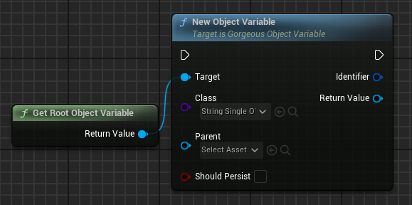
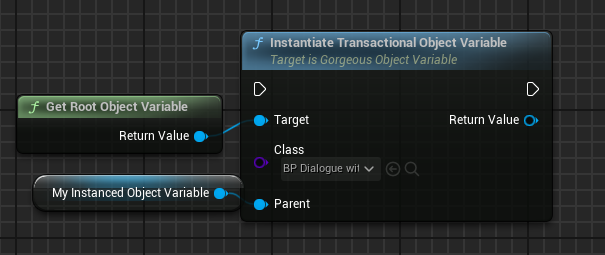
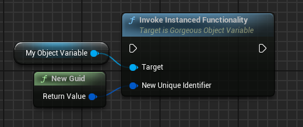
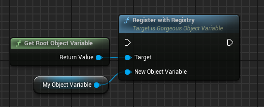
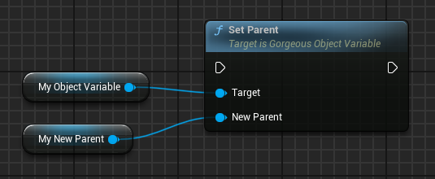

# ✨ Object Variable (Blueprint & C++)

???+ info "Short Description"

    The `UGorgeousObjectVariable` class is the base class for defining variables as objects within the Gorgeous Things ecosystem. It provides a flexible and extensible way to represent variables as UObjects, supporting single, array, map, and set types.

??? info "Long Description"

    `UGorgeousObjectVariable` serves as the foundation for creating and managing variables as objects in the Gorgeous Things plugin. This class offers a structured approach to variable handling, enabling dynamic data storage, network replication, and various data organization methods.

##   🚀 Features

### `NewObjectVariable`
=== "📝 Function Details"

    <div class="function-description">

    Constructs a new object variable and registers it within the given registry depending on the parent given.

    ??? tip
        When you set the parent to an object variable that is **not** the Root Object Variable, you can create a hierarchical structure. This allows you to organize and manage your variables in a tree-like fashion.
    </div>


    === "Input"

        |   Parameter         |   Type                                    |   Description                                                                                   |
        | :------------------ | :---------------------------------------- | :---------------------------------------------------------------------------------------------- |
        |   `Class`           |   `TSubclassOf<UGorgeousObjectVariable>`  |   The class that the object variable should derive from.                                        |
        |   `Parent`          |   `UGorgeousObjectVariable*`              |   The parent of this object variable. The chain can be followed up to the root object variable. |
        |   `bShouldPersist`  |   `bool`                                  |   Weather this object variable should be persistent across level switches.                      |

    === "Output"

        |   Parameter     |   Type                       |   Description                                   |
        | :-------------- | :--------------------------- | :---------------------------------------------- |
        |   `ReturnType`  |   `UGorgeousObjectVariable*` |   A new variable in object format.              |
        |   `Identifier`  |   `FGuid`                    |   The unique identifier of the object variable. |
    
    ??? note "Important"

        Ensure that the `Class` is valid before calling this function. Registering a null or invalid class can lead to unexpected behavior and potential crashes.

    ??? note "Important"

        Ensure that the `Parent` pointer is valid before calling this function. Registering a null or invalid pointer can lead to unexpected behavior and potential crashes.

=== "📚 Usage Examples"

    === "C++"

        ```cpp hl_lines="4"
        UGorgeousRootObjectVariable* RootObjectVariable = UGorgeousRootObjectVariable::GetRootObjectVariable();

        FGuid MyNewObjectVariableIdentifier;
        UGorgeousObjectVariable* MyNewObjectVariable = RootObjectVariable->NewObjectVariable(UString_SOV::StaticClass(), MyNewObjectVariableIdentifier, nullptr, false);
        ```
    
    === "Blueprint"

        <figure markdown="span">
        { width="100%" }
        <figcaption>Register new Object Variable with Root Object Variable as the parent.</figcaption>
        </figure>

### `InstantiateTransactionalObjectVariable`
=== "📝 Function Details"

    <div class="function-description">

    Instantiates a new object variable of the specified class as transactional and registers it as a child of the given Parent for persistence across editor sessions.


    </div>

    === "Input"

        |   Parameter   |   Type                                    |   Description                                      |
        | :------------ | :---------------------------------------- | :------------------------------------------------- |
        |   `Class`     |   `TSubclassOf<UGorgeousObjectVariable>`  |   The class of the object variable to instantiate. |
        |   `Parent`    |   `UGorgeousObjectVariable*`              |   The parent of the new instance.                  |

    === "Output"

        |   Parameter     |   Type                      |   Description                      |
        | :-------------- | :-------------------------- | :--------------------------------- |
        |   `ReturnType`  |   `UGorgeousObjectVariable` |   The new transactional instance.  |

    ??? note "Important"

        Ensure that the `Class` is valid before calling this function. Registering a null or invalid class can lead to unexpected behavior and potential crashes.

    ??? note "Important"

        Ensure that the `Parent` pointer is valid before calling this function. Registering a null or invalid pointer can lead to unexpected behavior and potential crashes.

=== "📚 Usage Examples"

    === "C++"

        ```cpp hl_lines="4"
        UGorgeousRootObjectVariable* RootObjectVariable = UGorgeousRootObjectVariable::GetRootObjectVariable();

        FGuid MyNewObjectVariableIdentifier;
        UGorgeousObjectVariable* MyNewObjectVariable = RootObjectVariable->InstantiateTransactionalObjectVariable(UString_SOV::StaticClass(), nullptr);
        ```
    
    === "Blueprint"

        <figure markdown="span">
        { width="100%" }
        <figcaption>Creates a new Transactional Object Variable that persists across editor restarts.</figcaption>
        </figure>


### `InvokeInstancedFunctionality`
=== "📝 Function Details"

    <div class="function-description">

    Invokes the instanced functionality for when the ObjectVariable is contained inside a UPROPERTY with the Instanced meta specifier.

    </div>

    === "Input"

        |   Parameter              |   Type    |   Description                |
        | :----------------------- | :--- ---- | :--------------------------- |
        |   `NewUniqueIdentifier`  |   `FGuid` |   The new unique identifier. |

=== "📚 Usage Examples"

    === "C++"

        ```cpp hl_lines="4"
        UGorgeousObjectVariable* MyObjectVariable = ...;

        bool OutValue;
        MyObjectVariable->InvokeInstancedFunctionality(FGuid::NewGuid());
        ```

    === "Blueprint"

        <figure markdown="span">
        { width="100%" }
        <figcaption>Makes an instanced Object Variable that persists inside an outer eligible for the Variable Registry.</figcaption>
        </figure>


### `RegisterWithRegistry`
=== "📝 Function Details"

    <div class="function-description">

    Registers the object variable with the Gorgeous Core registry. This crucial step ensures that the variable is tracked and managed by the system, allowing it to participate in the Gorgeous Things ecosystem's functionality.

    </div>

    ??? example "Usage"
        This function is typically called internally by the system when a new `UGorgeousObjectVariable` is created. However, you might need to call it manually in specific scenarios, such as when re-registering a variable after a specific event.


    === "Input"

        |   Parameter           |   Type                                   |   Description                                                             |
        | :-------------------- | :--------------------------------------- | :------------------------------------------------------------------------ |
        |   `NewObjectVariable` |   `TObjectPtr<UGorgeousObjectVariable>`  |   A pointer to the object variable instance that needs to be registered.  |

    ??? note "Important"

        Ensure that the `NewObjectVariable` pointer is valid before calling this function. Registering a null or invalid pointer can lead to unexpected behavior and potential crashes.

=== "📚 Usage Examples"

    === "C++"

        ```cpp hl_lines="3"
        UGorgeousObjectVariable* RootObjectVariable = UGorgeousRootObjectVariable::GetRootObjectVariable();

        RootObjectVariable->RegisterWithRegistry(MyObjectVariable);
        ```
    
    === "Blueprint"

        <figure markdown="span">
        { width="100%" }
        <figcaption>Registers the given Object Variable within the registry of the target object.</figcaption>
        </figure>


### `SetParent`
=== "📝 Function Details"

    <div class="function-description">

    Sets the parent of this object variable. Object variables can be organized in a hierarchy, and this function establishes the parent-child relationship.

    </div>

    === "Input"

        |   Parameter    |   Type                       |   Description                             |
        | :------------- | :--------------------------- | :---------------------------------------- |
        |   `NewParent`  |   `UGorgeousObjectVariable*` |   The new parent of the object variable.  |

    ??? note "Important"

        Ensure that the `NewParent` pointer is valid before calling this function. Registering a null or invalid pointer can lead to unexpected behavior and potential crashes.

=== "📚 Usage Examples"

    === "C++"

        ```cpp hl_lines="4"
        UGorgeousObjectVariable* MyObjectVariable = ...;

        bool OutValue;
        MyObjectVariable->SetParent(MyNewParent);
        ```

    === "Blueprint"

        <figure markdown="span">
        { width="100%" }
        <figcaption>Reorganizes the hierarchy for a given object variable and sets the given parent as the new one.</figcaption>
        </figure>


### `SetDynamicProperty`
=== "📝 Function Details"

    <div class="function-description">

    Constructs a new object variable and registers it within the given registry depending on the parent given.

    </div>

    === "Template Parameters"

        |   Parameter               |     Description                   |
        | :-----------------------  | :-------------------------------- |
        |   `InTCppType`            |   The C++ type of the property.   |
        |   `TInPropertyBaseClass`  |   The base class of the property. |

    === "Input"

        |   Parameter       |   Type            |   Description                         |
        | :---------------- | :---------------- | :------------------------------------ |
        |   `PropertyName`  |   `FName`         |   The name of the property to set.    |
        |   `Value`         |   `InTCppType*`   |   The value to set.                   |

=== "📚 Usage Examples"

    === "C++"

        ```cpp hl_lines="3"
        UGorgeousObjectVariable* MyObjectVariable = ...;

        MyObjectVariable->SetDynamicProperty<TArray<bool>, FProperty>("SomePropertyName", false);
        ```


### `GetDynamicProperty`
=== "📝 Function Details"

    <div class="function-description">

    Gets a dynamic property of the object variable at runtime. This function retrieves the value of a property at runtime.

    </div>

    === "Template Parameters"

        |   Parameter               |     Description                   |
        | :-----------------------  | :-------------------------------- |
        |   `InTCppType`            |   The C++ type of the property.   |
        |   `TInPropertyBaseClass`  |   The base class of the property. |

    === "Input"

        |   Parameter       |   Type            |   Description                         |
        | :---------------- | :---------------- | :------------------------------------ |
        |   `PropertyName`  |   `FName`         |   The name of the property to get.    |

    === "Output"

        |   Parameter     |   Type           |   Description                                                          |
        | :-------------- | :--------------- | :--------------------------------------------------------------------- |
        |   `ReturnType`  |   `bool`         |   True if the property was successfully retrieved, false otherwise.    |
        |   `OutValue`    |   `InTCppType`   |   The output value of the property.                                    |

=== "📚 Usage Examples"

    === "C++"

        ```cpp hl_lines="4"
        UGorgeousObjectVariable* MyObjectVariable = ...;

        bool OutValue;
        MyObjectVariable->GetDynamicProperty<bool, FProperty>("SomePropertyName", OutValue);
        ```

---


###   Variable Properties

|   Property             |   Type                                           |   Description                                                                     |
| :--------------------- | :----------------------------------------------- | :-------------------------------------------------------------------------------- |
|   `UniqueIdentifier`   |   `FGuid`                                        |   A unique identifier for the object variable.                                    |
|   `VariableRegistry`   |   `TArray<TObjectPtr<UGorgeousObjectVariable>>`  |   The registry of child object variables.                                         |
|   `bPersistent`        |   `bool`                                         |   Indicates whether the variable persists across level transitions.               |
|   `Parent`             |   `UGorgeousObjectVariable*`                     |   The parent object variable in the hierarchy.                                    |

??? abstract

    The `UE_DEFINE_OBJECT_VARIABLE_*_INTERFACE` and `UE_DECLARE_OBJECT_VARIABLE_DEFAULT_*_IMPLEMENTATION` macros are used to automatically generate getter and setter functions for various variable types (single, array, map, set). They simplify the process of defining how object variables interact with different data types.

<style>
.function-description {
    margin-top: 0.5em;
    font-style: italic;
    color: #555;
}
</style>