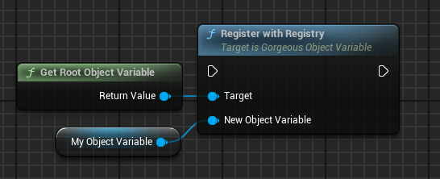

# ✨ Root Object Variable (Blueprint & C++)

???+ info "Short Description"

    The `UGorgeousRootObjectVariable` class serves as the central registry for all object variables within the Gorgeous Things ecosystem. It implements a singleton pattern for global access and provides comprehensive management of object variables.

??? info "Long Description"

    `UGorgeousRootObjectVariable` is the foundation of the object variable system in Gorgeous Things. As a singleton, it provides a centralized point of access for all object variables, managing their registration, hierarchy, and lifecycle. This class extends the base `UGorgeousObjectVariable` class with additional functionality specific to the root registry.

##   🚀 Features

### `GetRootObjectVariable`
=== "📝 Function Details"

    <div class="function-description">

    Gets the singleton instance of the root object variable, providing global access to the central registry.

    </div>

    === "Output"

        |   Parameter     |   Type                      |   Description                                   |
        | :-------------- | :-------------------------- | :---------------------------------------------- |
        |   `ReturnType`  |   `UGorgeousRootObjectVariable*` |   The singleton instance of the root object variable. |
    
    ??? note "Important"

        This function is the primary way to access the root object variable. It ensures that only one instance exists throughout the application lifecycle.

=== "📚 Usage Examples"

    === "C++"

        ```cpp hl_lines="3"
        UGorgeousRootObjectVariable* RootObjectVariable = UGorgeousRootObjectVariable::GetRootObjectVariable();
        
        // Now you can use the root object variable to create new object variables
        FGuid MyNewObjectVariableIdentifier;
        UGorgeousObjectVariable* MyNewObjectVariable = RootObjectVariable->NewObjectVariable(UString_SOV::StaticClass(), MyNewObjectVariableIdentifier, nullptr, false);
        ```
    
    === "Blueprint"

        <figure markdown="span">
        { width="100%" }
        <figcaption>Get the singleton instance of the Root Object Variable.</figcaption>
        </figure>

### `GetVariableHierarchyRegistry`
=== "📝 Function Details"

    <div class="function-description">

    Retrieves the complete hierarchy registry of all object variables, including those nested within other object variables.

    </div>

    === "Output"

        |   Parameter     |   Type                      |   Description                                   |
        | :-------------- | :-------------------------- | :---------------------------------------------- |
        |   `ReturnType`  |   `TArray<UGorgeousObjectVariable*>` |   An array containing all registered object variables in the hierarchy. |
    
    ??? note "Important"

        This function returns a flat array of all object variables in the hierarchy, regardless of their nesting level. This is useful for operations that need to process all object variables regardless of their position in the hierarchy.

=== "📚 Usage Examples"

    === "C++"

        ```cpp hl_lines="3"
        TArray<UGorgeousObjectVariable*> AllVariables = UGorgeousRootObjectVariable::GetVariableHierarchyRegistry();
        
        // Process all variables in the hierarchy
        for (UGorgeousObjectVariable* Variable : AllVariables)
        {
            // Do something with each variable
        }
        ```
    
    === "Blueprint"

        <figure markdown="span">
        { width="100%" }
        <figcaption>Get all object variables in the hierarchy as a flat array.</figcaption>
        </figure>

### `GetRootVariableRegistry`
=== "📝 Function Details"

    <div class="function-description">

    Retrieves the registry of root-level object variables, which are direct children of the root object variable.

    </div>

    === "Output"

        |   Parameter     |   Type                      |   Description                                   |
        | :-------------- | :-------------------------- | :---------------------------------------------- |
        |   `ReturnType`  |   `TArray<UGorgeousObjectVariable*>` |   An array containing all root-level object variables. |
    
    ??? note "Important"

        This function returns only the top-level object variables that are direct children of the root object variable. It does not include nested variables.

=== "📚 Usage Examples"

    === "C++"

        ```cpp hl_lines="3"
        TArray<UGorgeousObjectVariable*> RootVariables = UGorgeousRootObjectVariable::GetRootVariableRegistry();
        
        // Process only root-level variables
        for (UGorgeousObjectVariable* Variable : RootVariables)
        {
            // Do something with each root variable
        }
        ```
    
    === "Blueprint"

        <figure markdown="span">
        { width="100%" }
        <figcaption>Get only the root-level object variables.</figcaption>
        </figure>

### `RemoveVariableFromRegistry`
=== "📝 Function Details"

    <div class="function-description">

    Removes a variable from the registry, effectively unregistering it from the system.

    </div>

    === "Input"

        |   Parameter         |   Type                                    |   Description                                                                                   |
        | :------------------ | :---------------------------------------- | :---------------------------------------------------------------------------------------------- |
        |   `VariableToRemove`|   `UGorgeousObjectVariable*`              |   The object variable to remove from the registry.                                              |

    ??? note "Important"

        This function will remove the variable from the registry, but it will not delete the variable itself. The variable will still exist in memory until it is garbage collected.

=== "📚 Usage Examples"

    === "C++"

        ```cpp hl_lines="3"
        UGorgeousObjectVariable* VariableToRemove = ...;
        
        UGorgeousRootObjectVariable::RemoveVariableFromRegistry(VariableToRemove);
        ```
    
    === "Blueprint"

        <figure markdown="span">
        { width="100%" }
        <figcaption>Remove an object variable from the registry.</figcaption>
        </figure>

### `IsVariableRegistered`
=== "📝 Function Details"

    <div class="function-description">

    Checks if a given object variable is already registered with the registry.

    </div>

    === "Input"

        |   Parameter   |   Type                                    |   Description                                      |
        | :------------ | :---------------------------------------- | :------------------------------------------------- |
        |   `Variable`  |   `UGorgeousObjectVariable*`              |   The variable to check for existence in the registry. |

    === "Output"

        |   Parameter     |   Type    |   Description                                   |
        | :-------------- | :-------- | :---------------------------------------------- |
        |   `ReturnType`  |   `bool`  |   True if the variable is registered, false otherwise. |
    
    ??? note "Important"

        This function checks both the root registry and the registries of all other variables to determine if the variable is registered anywhere in the hierarchy.

=== "📚 Usage Examples"

    === "C++"

        ```cpp hl_lines="3"
        UGorgeousObjectVariable* MyVariable = ...;
        
        bool bIsRegistered = UGorgeousRootObjectVariable::IsVariableRegistered(MyVariable);
        if (bIsRegistered)
        {
            // Variable is already registered
        }
        ```
    
    === "Blueprint"

        <figure markdown="span">
        { width="100%" }
        <figcaption>Check if an object variable is already registered.</figcaption>
        </figure>

### `CleanupRegistry`
=== "📝 Function Details"

    <div class="function-description">

    Cleans up the registry, optionally performing a full cleanup.

    </div>

    === "Input"

        |   Parameter     |   Type    |   Description                                   |
        | :-------------- | :-------- | :---------------------------------------------- |
        |   `bFullCleanup`|   `bool`  |   Whether to perform a full cleanup. Defaults to false. |

    ??? note "Important"

        This function is useful for cleaning up the registry, especially when transitioning between levels or when you want to ensure that all variables are properly unregistered.

=== "📚 Usage Examples"

    === "C++"

        ```cpp hl_lines="3"
        // Perform a standard cleanup
        UGorgeousRootObjectVariable::CleanupRegistry();
        
        // Or perform a full cleanup
        UGorgeousRootObjectVariable::CleanupRegistry(true);
        ```
    
    === "Blueprint"

        <figure markdown="span">
        { width="100%" }
        <figcaption>Clean up the object variable registry.</figcaption>
        </figure>

### `SetUniversalVariable`
=== "📝 Function Details"

    <div class="function-description">

    Sets the value of a property with any type for an object variable identified by its unique identifier.

    </div>

    === "Input"

        |   Parameter           |   Type    |   Description                                   |
        | :-------------------- | :-------- | :---------------------------------------------- |
        |   `Identifier`        |   `FGuid` |   The unique identifier of the object variable. |
        |   `OptionalPropertyName`|   `FName` |   The name of the property to set. Defaults to "Value" if not specified. |
        |   `Value`             |   `int32` |   The value to set. The actual type depends on the property. |

    ??? note "Important"

        This function uses a custom thunk to handle different property types. The actual type of the `Value` parameter will be determined by the property being set.

=== "📚 Usage Examples"

    === "C++"

        ```cpp hl_lines="3"
        FGuid VariableIdentifier = ...;
        
        // Set a property value
        UGorgeousRootObjectVariable::SetUniversalVariable(VariableIdentifier, "MyProperty", 42);
        ```
    
    === "Blueprint"

        <figure markdown="span">
        { width="100%" }
        <figcaption>Set a property value for an object variable by its identifier.</figcaption>
        </figure>

### `GetUniversalVariable`
=== "📝 Function Details"

    <div class="function-description">

    Gets the value of a property with any type from an object variable identified by its unique identifier.

    </div>

    === "Input"

        |   Parameter           |   Type    |   Description                                   |
        | :-------------------- | :-------- | :---------------------------------------------- |
        |   `Identifier`        |   `FGuid` |   The unique identifier of the object variable. |
        |   `OptionalPropertyName`|   `FName` |   The name of the property to get. Defaults to "Value" if not specified. |

    === "Output"

        |   Parameter     |   Type    |   Description                                   |
        | :-------------- | :-------- | :---------------------------------------------- |
        |   `OutValue`    |   `int32` |   The output value. The actual type depends on the property. |

    ??? note "Important"

        This function uses a custom thunk to handle different property types. The actual type of the `OutValue` parameter will be determined by the property being retrieved.

=== "📚 Usage Examples"

    === "C++"

        ```cpp hl_lines="3"
        FGuid VariableIdentifier = ...;
        int32 OutValue;
        
        // Get a property value
        UGorgeousRootObjectVariable::GetUniversalVariable(VariableIdentifier, "MyProperty", OutValue);
        ```
    
    === "Blueprint"

        <figure markdown="span">
        { width="100%" }
        <figcaption>Get a property value from an object variable by its identifier.</figcaption>
        </figure>

### `RegisterWithRegistry`
=== "📝 Function Details"

    <div class="function-description">

    Registers a new object variable with the registry. This is an override of the base class method.

    </div>

    === "Input"

        |   Parameter           |   Type                                    |   Description                                      |
        | :-------------------- | :---------------------------------------- | :------------------------------------------------- |
        |   `NewObjectVariable` |   `UGorgeousObjectVariable*`              |   The object variable to register.                  |

    ??? note "Important"

        This function is typically called internally by the system when a new `UGorgeousObjectVariable` is created. However, you might need to call it manually in specific scenarios.

=== "📚 Usage Examples"

    === "C++"

        ```cpp hl_lines="3"
        UGorgeousObjectVariable* MyNewVariable = ...;
        
        UGorgeousRootObjectVariable::GetRootObjectVariable()->RegisterWithRegistry(MyNewVariable);
        ```
    
    === "Blueprint"

        <figure markdown="span">
        { width="100%" }
        <figcaption>Register a new object variable with the root registry.</figcaption>
        </figure>

---

###   Variable Properties

|   Property             |   Type                                           |   Description                                                                     |
| :--------------------- | :----------------------------------------------- | :-------------------------------------------------------------------------------- |
|   `RootVariableRegistry`   |   `static TArray<TObjectPtr<UGorgeousObjectVariable>>`  |   The registry of root-level object variables.                                    |
|   `SingletonRootInstance`   |   `static TObjectPtr<UGorgeousRootObjectVariable>`  |   The singleton instance of the root object variable.                                    |

<style>
.function-description {
    margin-top: 0.5em;
    font-style: italic;
    color: #555;
}
</style>