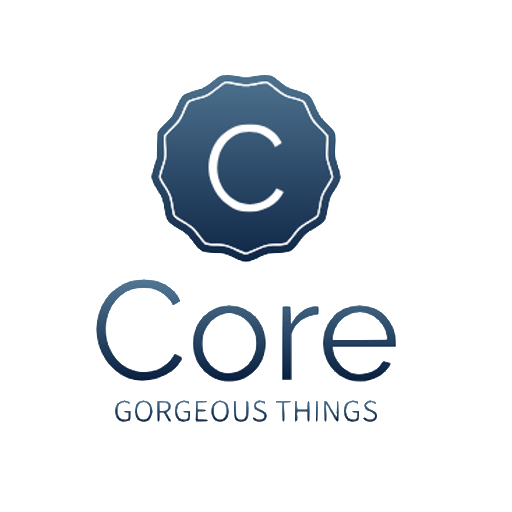
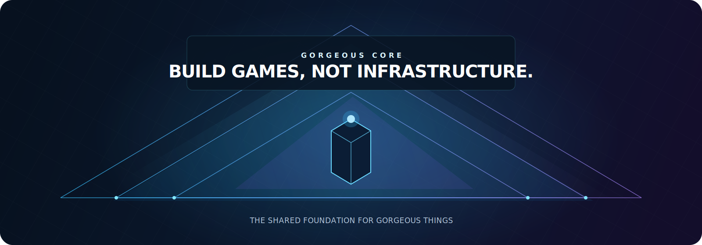
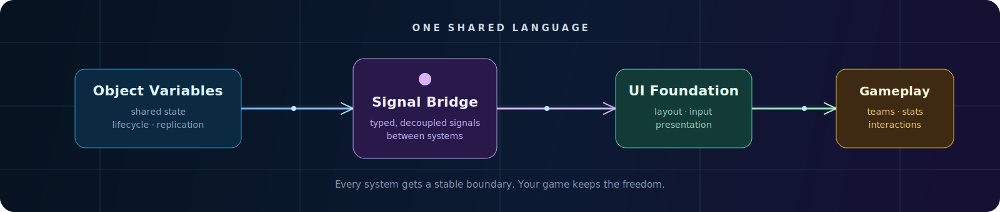
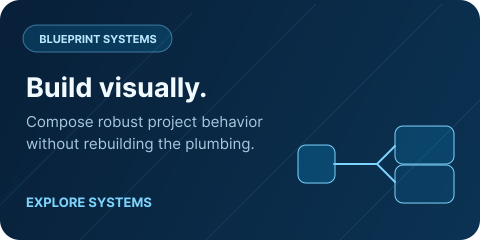
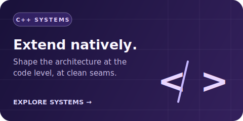
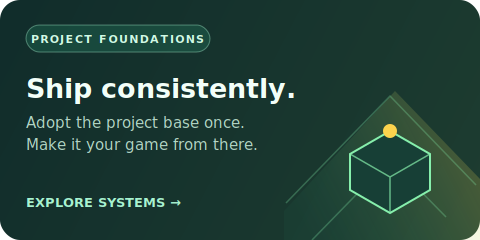

<!-- PROJECT LOGO -->
 

  

  
<h3 align="center">Gorgeous Things: Gorgeous Core</h3>

  

    <strong>Build games, not infrastructure.</strong> Spend your time creating worlds, not repeatedly pouring the same foundation.
     
     
    <a href="https://gorgeous.simsalabim.studio/docs"><strong>Explore the docs</strong></a>
     
    <a href="https://gorgeous.simsalabim.studio/#faq"><strong>FAQ »</strong></a>
    &middot;
    <a href="https://github.com/Epic-Nova/Gorgeous-Core/issues/new?template=bug_report.yaml"><strong>Report Bug »</strong></a>
    &middot;
    <a href="https://github.com/Epic-Nova/Gorgeous-Core/issues/new?template=feature_request.yaml"><strong>Request Feature »</strong></a>
    &middot;
    <a href="https://gorgeous.simsalabim.studio"><strong>Plugin Family</strong></a>
  

<!-- PROJECT SHIELDS -->

  <h2>Built With</h2>

  
  
  

  <h2>Stats</h2>

  
  
  
  
  

<!-- TABLE OF CONTENTS -->

  
Table of Contents

  <ol>
    <li>
      <a href="#-about-the-project">About The Project</a>
    </li>
    <li>
      <a href="./.github/DEVELOPMENT.md">Getting Started</a>
      <ul>
        <li><a href="https://github.com/Epic-Nova/Gorgeous-Core/blob/master/.github/DEVELOPMENT.md#-getting-started-with-unreal-engine">Prerequisites</a></li>
        <li><a href="https://github.com/Epic-Nova/Gorgeous-Core/blob/master/.github/DEVELOPMENT.md#-blueprint-only-users-no-c-required">Installation</a></li>
      </ul>
    </li>
    <li><a href="#️-usage">Usage</a></li>
    <li><a href="#-roadmap">Roadmap</a></li>
    <li><a href="#-contributing">Contributing</a></li>
    <li><a href="#-license">License</a></li>
    <li><a href="#-contact">Contact</a></li>
    <li><a href="#-acknowledgments">Acknowledgments</a></li>
  </ol>

<!-- ABOUT THE PROJECT -->
## 🧩 About The Project

  <picture>
    <source media="(prefers-color-scheme: light)" srcset="./.github/ProjectBanner-light.svg">
    
  </picture>

**Gorgeous Core is the architectural foundation of the Gorgeous Things ecosystem.** It exists because game teams should not have to rebuild the same invisible work for every project: networking, object systems, replication, developer tooling, build infrastructure, project architecture, and the contracts that let plugins work together.

> [!IMPORTANT]
> Gorgeous Core is not another feature plugin. It is the shared architecture every Gorgeous Things capability is designed to build upon.

It is intentionally not the exciting plugin. It is intentionally the dependable part underneath every other Gorgeous Things plugin—the part that makes new capabilities feel native to the same project instead of bolted on beside it.

When it is doing its job, the reaction should not be “wow.” It should be: **good, I never have to solve this again.**

### One foundation. Many games.

Gorgeous Things is an ecosystem, not a collection of isolated plugins. Core establishes a shared language for data, signals, tooling, UI, and gameplay foundations. Each plugin can then solve its own problem without bringing a second architecture, a new communication model, or another round of integration work with it.

  
   
  Click to explore the Gorgeous Things documentation.

(<a href="#readme-top">back to top</a>)

---

<!-- USAGE EXAMPLES -->
## 🛠️ Usage

Core is not a monolith you have to adopt all at once. Start with the system that removes work from the game you are making; the shared foundation keeps the next system from becoming a second integration project.

  
  
  

### Choose your first problem

| I need to… | Start with |
| --- | --- |
| Keep structured game state consistent | [Object Variables](#blueprint-systems) |
| Let systems communicate without hard references | [Signal Bridge](#blueprint-systems) |
| Give UI a shared project language | [Common UI Foundation](#project-implementations) |
| Reuse player interactions across the game | [Interaction Foundation](#general-systems) |

### 🟦 Blueprint systems

Built for visually composing project behavior while Core handles the connective architecture underneath.

| System | Description |
| --- | --- |
| **Object Variables** | Persistent, structured object state with hierarchy, lifecycle and replication-aware foundations. |
| **Data Migration Mapping** | Declarative mappings and transforms for moving data from one schema or source shape to another. |
| **Signal Bridge** | Gameplay-tagged signals with typed payloads, so systems can communicate without hard references. |
| **Conditional Object Choosers** | Data-driven object selection through reusable conditions instead of a growing web of branches. |
| **Visual Data Gathering** | Editor-facing tools for collecting, inspecting and shaping data where designers work. |

### 🟪 C++ systems

Native extension points and engineering tools for teams shaping the architecture at the code level.

| System | Description |
| --- | --- |
| **Debug Assist** | Runtime debug helpers—such as in-world beacons and diagnostic support—when a system needs to become visible. |
| **Insight Matrix** | A focused panel for running, observing and understanding registered Core insight and test scenarios. |

### 🟨 Project implementations

Practical building blocks that establish a consistent solution for a project concern, then leave room for the game to make it its own.

| System | Description |
| --- | --- |
| **Common UI Foundation** | A policy-led UI base for layouts, input, theming and CommonUI-compatible widgets. |

### 🟩 General systems

Small, composable gameplay foundations. Use one when it solves the problem; combine them when the game asks for more.

| System | Description |
| --- | --- |
| **Team System** | Shared team identity and relationship rules for actors and gameplay decisions. |
| **Playlist System** | Data-driven selection and management of playable modes, content sets or rotations. |
| **Interaction Foundation** | A common contract for discovering, presenting and executing player interactions. |
| **Stats Foundation** | Replicated stat storage, modifiers and change notifications that can connect to the Signal Bridge. |
| **Feedback Effects** | A consistent path for triggering gameplay feedback without binding the caller to a specific presentation. |

You’ll find practical usage examples inside the plugin’s `Content` **folder**, including Blueprint utilities, test scenes, and Core system references.

*For more documentation and advanced scenarios, check the [Documentation](https://gorgeous.simsalabim.studio/docs).*

(<a href="#readme-top">back to top</a>)

---

<!-- ROADMAP -->
## 🗺️ Roadmap

📌 You can follow our **live roadmap** and submit ideas or feedback here: [👉 Gorgeous Core Roadmap on GitHub Projects](https://github.com/orgs/Epic-Nova/projects/12/views/4)

*For a full list of upcoming features and bugs, check the [open issues](https://github.com/Epic-Nova/Gorgeous-Core/issues).*

(<a href="#readme-top">back to top</a>)

---

<!-- CONTRIBUTING -->
## 🤝 Contributing

Contributions are what make the open source community such an amazing place to learn, inspire, and create — and **any contributions are truly appreciated.**

If you have ideas to improve Gorgeous Core, feel free to:

  - 🛠 Fork the repository
  - 🧪 Implement your feature or fix
  - 📬 Submit a pull request
  - 📣 Or open an **[Bug Report](https://github.com/Epic-Nova/Gorgeous-Core/issues/new?template=bug_report.yaml)**, **[Feature Request](https://github.com/Epic-Nova/Gorgeous-Core/issues/new?template=feature_request.yaml)** or **[Question issue](https://github.com/Epic-Nova/Gorgeous-Core/issues/new?template=question.yaml)**.

> [!TIP]
> 📄 For detailed contribution guidelines, please see [CONTRIBUTING.md](./.github/CONTRIBUTING.md)

(<a href="#readme-top">back to top</a>)

### 🏆 Top contributors:

  

---

<!-- LICENSE -->
## 📄 License

### Distributed under the **MIT License.** See [`LICENSE`](./LICENSE) for more information.

---

(<a href="#readme-top">back to top</a>)

---

<!-- CONTACT -->
## 📬 Contact

### 🔗 Connect with Us:
- **Community Server** - [Discord: Gorgeous Things][Discord-Invite-URL] - Join our vibrant community!
- **General Support** - [Epic Nova Support](mailto:support@epicnova.net) - For questions or assistance.
- **Report Harmful Content** - [Epic Nova Enforcement Team](mailto:enforcement@epicnova.net) - See something harmful? Let us know
- **Vulnerability Reporting** - [Epic Nova Vulnerability Support](mailto:vulnerabilities@epicnova.net) - If you discover a potential security issue.

### 👨‍💻 Developer Contact:
- [**Nils Bergemann:**](https://cto.employee.epicnova.net) Lead Developer
  - [Email][Developer-Mail]
  - [LinkedIn][LinkedIn-URL]

(<a href="#readme-top">back to top</a>)

---

<!-- SUPPORT -->
## 💖 Support

If you find this project useful or just want to support ongoing development, consider giving the repo a ⭐, sharing it with others, or contributing to the codebase!

For business inquiries, collaborations, or plugin licensing, feel free to reach out via the [contact section](#-contact) above.

(<a href="#readme-top">back to top</a>)

---

<!-- ACKNOWLEDGMENTS -->
## 🙏 Acknowledgments

Big thanks to:
* [README Template][Readme-Template-URL]
* [Epic Nova][EpicNova-URL] – for handling all things publishing, financing, and business-side support for Simsalabim Studios. 💼🚀

(<a href="#readme-top">back to top</a>)

<!-- MARKDOWN LINKS & IMAGES -->
<!-- https://www.markdownguide.org/basic-syntax/#reference-style-links -->
[Discord-Invite-URL]: https://discord.gg/AQuez8fwFG

[Developer-Mail]: mailto:nils.bergemann@employee.epicnova.net
[LinkedIn-URL]: https://linkedin.com/in/nils-bergemann-6398a5280

[Readme-Template-URL]: https://github.com/othneildrew/Best-README-Template
[EpicNova-URL]: https://epicnova.net?utm_source=gt_repo&utm_medium=markdown&utm_campaign=gt_readme&utm_content=readme
